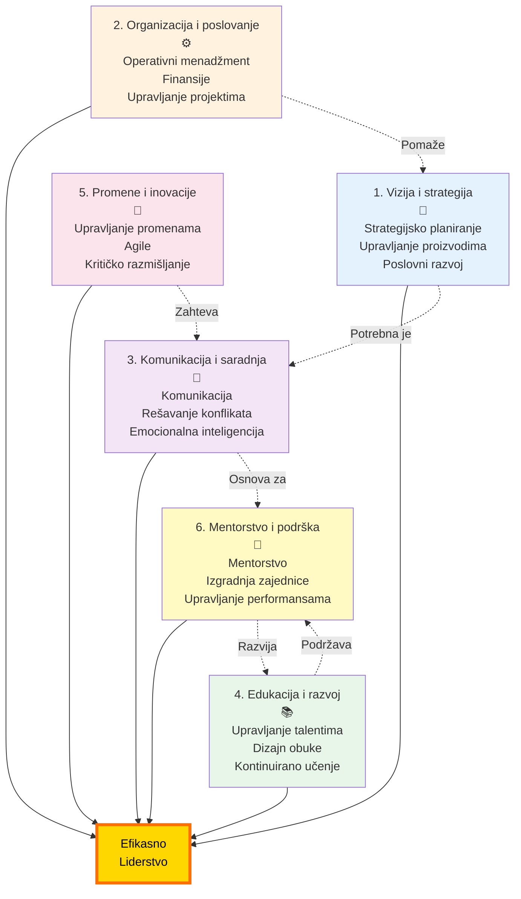

# Liderske kompetencije: Vodič za razvoj liderstva

## Uvod

Dobrodošli u sveobuhvatni vodič kroz ključne liderske kompetencije neophodne za uspeh u savremenom poslovnom okruženju. Ova knjiga je kreirana da pruži praktične smernice za lidere koji žele da razviju svoje veštine i postanu efikasniji u svojim ulogama.

### Zašto su liderske kompetencije važne?

U današnjem dinamičnom i rapidno promenljivom poslovnom svetu, efikasno liderstvo je više nego ikad pre kritično za uspeh organizacija. Lideri se suočavaju sa kompleksnim izazovima: globalna konkurencija, tehnološke disrupcije, promenljive očekivanja zaposlenih i konstantna potreba za inovacijama. Da bi navigirali kroz ove izazove, lideri moraju razviti širok spektar kompetencija koje prelaze tradicionalne menadžerske veštine.

Ova knjiga prepoznaje da liderstvo nije jednodimenzionalno. Umesto toga, uspešni lideri moraju biti vešti u više oblasti koje se međusobno nadopunjuju i grade osnovu za holistički pristup vođenju ljudi i organizacija.

### Šest ključnih oblasti kompetencija

Ova knjiga je organizovana oko **šest fundamentalnih oblasti liderskih kompetencija**:

**Detaljno:**

1. **Vizija i strategija** - Sposobnost da postavite pravac, formulišete strategije i inspirišete druge da slede vašu viziju

2. **Organizacija i poslovanje** - Operativne veštine potrebne za efikasno vođenje organizacije i održavanje poslovne izvrsnosti

3. **Komunikacija i saradnja** - Veštine za efikasnu komunikaciju, aktivno slušanje i izgradnju snažnih timova

4. **Edukacija i razvoj** - Kompetencije za razvijanje ljudi, upravljanje talentima i podsticanje kontinuiranog učenja

5. **Promene i inovacije** - Sposobnost da vodite kroz tranzicije, podstičete inovativnu kulturu i razmišljate kritički

6. **Mentorstvo i podrška** - Veštine za mentorstvo drugih, izgradnju zajednice i efikasno upravljanje performansama

### Kako koristiti ovu knjigu

Svako poglavlje u ovoj knjizi detaljno istražuje jednu oblast kompetencija, razlažući je na specifične veštine sa:

- **Jasnim definicijama** svake veštine i njenoj važnosti
- **Praktičnim savetima** za razvoj i primenu tih veština
- **Konkretnim strategijama** za poboljšanje kroz mentorstvo, obuku i praktično iskustvo
- **Istraživanjima i podacima** koji podržavaju efikasnost različitih pristupa

Možete čitati knjigu linearno od početka do kraja, ili se fokusirati na specifične oblasti gde osećate potrebu za razvojem. Svako poglavlje je dizajnirano da bude samostalno, omogućavajući vam da se vratite određenim kompetencijama kada vam zatreba.

### Uloga mentora i trenera u razvoju

Kroz čitavu knjigu, naglasak je stavljen na ulogu mentora, kouča i trenera u razvoju liderskih kompetencija. Dok samoučenje i praksa imaju svoju vrednost, vođenje od strane iskusnih profesionalaca može dramatično ubrzati vaš razvoj i pomoći vam da izbegnete uobičajene zamke.

Istraživanja konzistentno pokazuju da mentorstvo i formalna obuka vode:
- Bržem razvoju veština
- Višoj samopouzdanju u liderskim ulogama
- Boljim karijernim ishodima
- Većoj sposobnosti da naučene veštine primenjujete u praksi

### Fokus na praktičnu primenu

Ova knjiga nije samo teorijska. Svaka sekcija pruža **konkretne praktične savete** koje možete primeniti odmah u vašem radu. Od toga kako strukturisati razvojne razgovore, do načina na koje možete poboljšati svoje veštine rešavanja konflikata, do strategija za vođenje organizacionih promena – naći ćete akcione korake u svakom poglavlju.

### Kontinuirani razvoj kao filosofija

Konačno, ova knjiga je izgrađena na filosofiji da je razvoj liderstva **putovanje, a ne destinacija**. Poslovni svet će nastaviti da se razvija, a nove tehnologije, generacijske promene u radnoj snazi i globalni događaji zahtevat će da kontinuirano refinirate i prilagođavate vaše veštine.

Izgradnjom snažne osnove u ovim šest oblasti kompetencija, razvijate agilnost i otpornost potrebnu da rukujete sa svim što dolazi. A možda najvažnije, razvijate sposobnost da **ne samo postižete bolje rezultate, već i nalazite veće zadovoljstvo u vašoj liderskoj ulozi**.

---

## Za koga je ova knjiga?

Ova knjiga je dizajnirana za:

- **Trenutne lidere** koji žele da sistematski poboljšaju svoje kompetencije
- **Menadžere u nastajanju** koji se pripremaju za veće liderske odgovornosti
- **HR profesionalce** koji dizajniraju programe za razvoj liderstva
- **Mentore i koučeve** koji vode razvoj drugih lidera
- **Bilo koga** ko teži da razume šta čini efikasno liderstvo u savremenom kontekstu

Bez obzira gde ste na vašem liderskom putovanju, ova knjiga nudi uvide i alate koji će vam pomoći da rastete i prosperite.

---

Počnimo ovo putovanje kroz liderske kompetencije, počevši sa prvom ključnom oblašću: **Vizija i strategija**.
