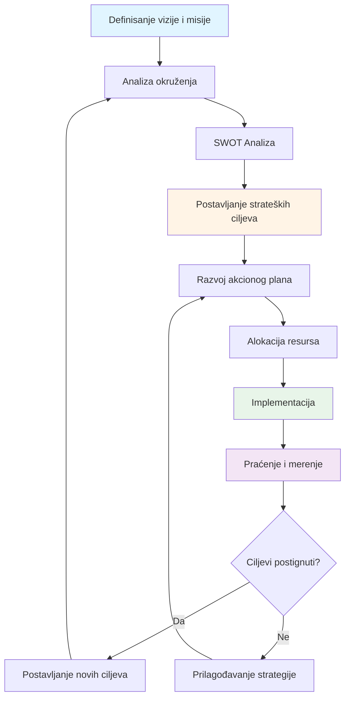
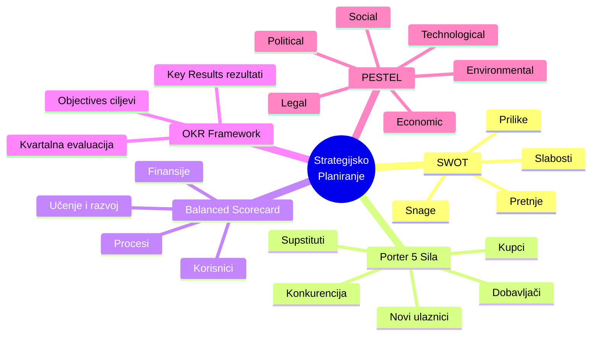
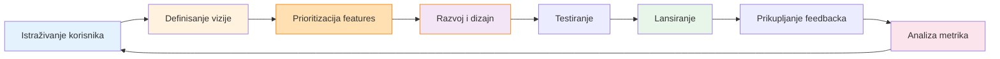
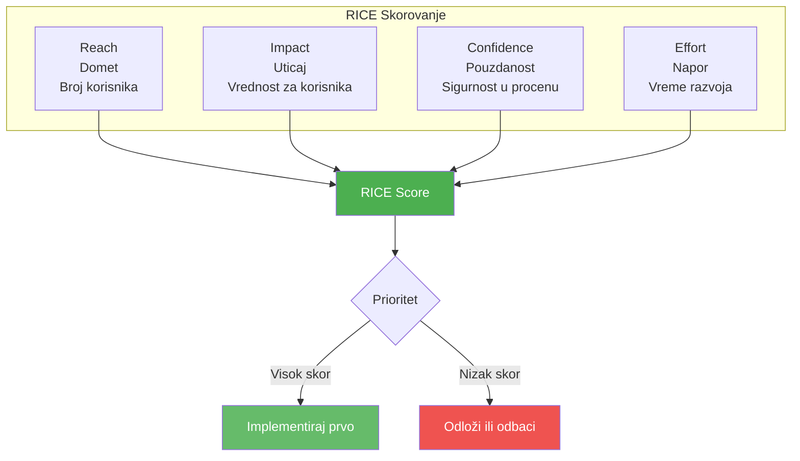
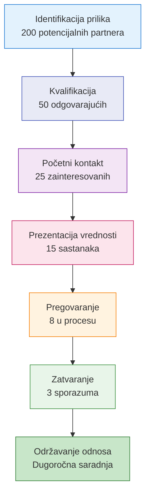

# 1. Vizija i strategija (Vision and Strategy)

Ova oblast kompetencija obuhvata sposobnost lidera da postavi pravac za organizaciju, formuliše strategije za postizanje ciljeva i inspiriše druge da prate tu viziju. Kao lider, vaša sposobnost da zamislite budućnost, planirate kako da dođete do nje i donesete ispravne strateške odluke je fundamentalna za uspeh. Ova oblast uključuje sledeće veštine:

## Strategijsko planiranje

**Strategijsko planiranje** je proces definisanja pravca organizacije i donošenja odluka o alokaciji resursa za ostvarivanje tog pravca. Ono uključuje postavljanje dugoročnih ciljeva, procenu unutrašnjih i spoljašnjih faktora, i kreiranje akcionog plana. Dobro strategijsko planiranje odgovara na pitanja kao što su "Gde želimo da budemo za 3-5 godina?" i "Kako ćemo tamo stići?"

Strategijsko planiranje oštrije fokusira organizaciju kanališući energiju ka "šaci ciljeva koji su presudni" koji zaista imaju značaj. Bez jasne strategije, organizacije mogu lutati ili gubljati resurse na inicijative koje nisu usklađene sa njihovom osnovnom misijom.

### 📊 Vizualizacija: Proces strategijskog planiranja

**Ključni alati za strategijsko planiranje:**

**Kako razviti veštine strategijskog planiranja:**

Da biste razvili veštine strategijskog planiranja, počnite razumevanjem osnovnih okvira:
- **SWOT analiza** (Snage, Slabosti, Prilike, Pretnje)
- **Porterova analiza pet sila** za razumevanje konkurentskog položaja
- **Balanced Scorecard** za strukturisanje planova
- **OKR framework** (Objectives and Key Results) za postavljanje i praćenje ciljeva
- **Strategijske mape** za vizualizaciju pravca

Ovi alati pomažu u strukturisanju razmišljanja o konkurentskoj poziciji i opcijama rasta. Praktikovanjem analize slučajeva ili učestvovanjem u strateškim planskim sesijama (čak i za mali tim ili projekat) dobijate praktično iskustvo. Takođe je korisno učiti od iskusnih stratega ili mentora koji vas mogu voditi kroz proces.

**Uloga mentora:**

Traženje mentora sa iskustvom u strategijskom planiranju (kao što je viši rukovodilac ili konsultant) može pružiti neocenjivo vođenje. Na primer, **mentori mogu pomoći menteeima da izbegnu uobičajene greške u planiranju i "otkriju slepe tačke" u strategiji kroz svoje iskustvo**. Iskusni menadžer može pokazati kako se identifikuju ključni prioriteti ili kako se balansira kratkoročne potrebe sa dugoročnom vizijom.

Mnoge organizacije takođe pozivaju eksterne konsultante ili trenere da vode strategijske sesije. Učestvovanje u takvim programima ili čak pohađanje radionica o strategiji i planiranju (kao što su MBA kursevi o strategiji) može biti veoma korisno.

**Praktične vežbe:**

Efikasno strategijsko planiranje takođe uključuje skaniranje okruženja da se predvide rizici i prilike rano. Vežbajte anticipaciju rizika – na primer, kada razvijate plan, pitajte se "Šta bi moglo poći naopako?" i napravite rezervne planove. Proučavajte studije slučaja uspešnih strateških pivota da naučite kako su drugi navigirali kroz promene.

## Upravljanje proizvodima

**Upravljanje proizvodima (Product Management)** je veština definisanja i razvoja proizvoda koji ispunjavaju potrebe korisnika dok postižu poslovne ciljeve. Lider sa ovom kompetencijom može prioritizovati karakteristike proizvoda, uskladiti različite stejkholdere (inženjering, dizajn, marketing, prodaju) i iterativno ga unapređivati zasnovano na povratnim informacijama. Ključne veštine uključuju jasnu viziju proizvoda, empatiju prema korisnicima i snažnu komunikaciju kako bi se inspirisala unakrsna funkcijska timska saradnja oko proizvoda.

### 📊 Vizualizacija: Životni ciklus upravljanja proizvodom

**RICE Framework za prioritizaciju:**

**Kako poboljšati upravljanje proizvodima:**

Razvijanje veština u upravljanju proizvodima znači učenje razumevanja potreba korisnika, tržišnih trendova i kako prevesti visokonu viziju u karakteristike proizvoda. Jedan ključni aspekt je **vizionarsko liderstvo u upravljanju proizvodima**, koje uključuje predviđanje budućih potreba korisnika i kreiranje proizvoda koji ne samo da odgovaraju na potražnju već je oblikuju.

**Praktični koraci:**

1. **Razumevanje korisničkih potreba** – Provodite vreme direktno sa korisnicima ili klijentima kada god je moguće (razgovori sa korisnicima, testiranje upotrebljivosti, prikupljanje povratnih informacija). To će izgraditi vašu sposobnost empatije.

2. **Naučite da prioritizujete** – Postoje okviri koji vam mogu pomoći da donesete odluke o tome šta graditi prvo:
   - **Kano analiza** za razumevanje koje karakteristike zadovoljavaju, oduševljavaju ili su obavezne
   - **RICE skorovanje** (Reach, Impact, Confidence, Effort) za kvantitativnu prioritizaciju
   - U praksi, menadžeri proizvoda često moraju reći "ne" mnogim zahtevima kako bi ostali fokusirani, što zahteva samopouzdanje i jasno razmišljanje.

3. **Tražite međufunkcionalna iskustva** – Sarađujte sa dizajnom, inženjeringom i marketingom da dobijete celovitu perspektivu.

4. **Formalna obuka** – Razmislite o obuci u upravljanju životnim ciklusom proizvoda ili agilnom razvoju proizvoda.

**Uloga mentorstva:**

Mentorstvo je izuzetno vredno ovde. Na primer, praćenje iskusnog menadžera proizvoda može naučiti kako oni prioritizuju backlog-e, donose odluke zasnovane na podacima i govore "ne" karakteristikama koje ne odgovaraju strategiji. Mnoge kompanije sada imaju interne programe obuke o liderstvu proizvoda ili šalju menadžere na eksterne programe "Product Leadership". Naročito oni koji su radili na sličnim proizvodima ili u sličnim industrijama mogu podeliti praktične uvide o navigaciji kroz tržišne kompromise i tehničke izazove.

## Poslovni razvoj

**Poslovni razvoj (Business Development)** se fokusira na pronalaženje novih prilika za rast – kroz partnerstva, nova tržišta ili nove kanale. Zahteva strateško i kritičko razmišljanje, umrežavanje i veštine pregovaranja. Najbolji poslovni razvojni stručnjaci su proaktivni i pokazuju snažan "duh inicijative", kako primećuju industrijski lideri. Oni su takođe odlučni: "donošenje strateških odluka je obavezno" u poslovnom razvoju.

### 📊 Vizualizacija: Levak poslovnog razvoja

**Kako poboljšati veštine poslovnog razvoja:**

Napredovanje u ovoj oblasti uključuje:

1. **Ostanite informisani** – Pratite svoju industriju i konkurente kontinuirano
2. **Oštre veštine pregovaranja i ubeđivanja** – Ove su suštinske za zatvaranje poslova
3. **Rutinska analiza tržišta** – Analizirajte poteze konkurencije i rupe na tržištu. Zapitajte se:
   - Da li postoje "nove tržišne prilike koje niste razmatrali"?
   - Ima li načina da smanjite troškove koje drugi ne vide?
4. **Aktivno slušanje i empatija** – Ovo je iznenađujuće važno jer razumevanje potreba potencijalnih klijenata ili partnera može kreirati bolje poslove

**Praktični razvoj:**

- Pohađajte prodajne i pregovaračke radionice
- Razmislite o rotaciji u prodajnu ulogu radi iskustva
- Proučavajte studije slučaja uspešnih poslovnih partnerstava i akvizicija

**Mentorstvo u poslovnom razvoju:**

Mentori koji su iskusni poslovni razvojni stručnjaci mogu vas obučiti u izgradnji odnosa i prepoznavanju pravih prilika, kao i upozoriti na zamke (kao što je pretrano proširivanje na previše poslova odjednom). Razmislite o pronalaženju mentora u vašoj profesionalnoj mreži koji ima evidenciju uspešnih poslova ili širenja – njihovo vođenje može biti instrumentalno u učenju kako "zatvoriti posao" dok kreirate uzajamnu vrednost.

## Analiza tržišta

**Analiza tržišta (Market Analysis)** je veština istraživanja i razumevanja tržišnog okruženja u kojem poslujete – uključujući segmente korisnika, konkurente i trendove. Ona podupire i strategiju i razvoj proizvoda pružanjem podataka za informisane odluke. Veliki stratezi imaju "dijagnostički aumen" za čitanje suptilnih signala u tržišnim podacima. Na primer, oni mogu uočiti nijansne trendove ili slabe signale koji ukazuju na nastajuće potrebe korisnika ili nadolazeće disrupcije.

**Kako izgraditi veštine analize tržišta:**

Da izgradite veštine analize tržišta, počnite sa osnovama analize podataka:

1. **Proučavajte tržišna istraživanja** – Čitajte industrijske izveštaje i razumejte metodologije
2. **Naučite da tumačite industrijske metrike** – ROI, tržišni udeo, stope rasta, itd.
3. **Koristite analitičke alate**:
   - Excel za osnovnu analizu
   - BI softveri za napredne vizualizacije
   - Google Analytics za digitalna tržišta
4. **Praktične vežbe**:
   - Sprovedite SWOT analizu za vaš biznis ili konkurenta
   - Koristite PESTEL analizu (Political, Economic, Social, Technological, Environmental, Legal) za makro-ekonomsko okruženje
5. **Negujte radoznalost** – Pitajte "zašto?" iza tržišnih pokreta i proveravajte pretpostavke sa dokazima

**Formalni razvoj:**

- Pohađajte kurseve o marketinškoj analitici ili finansijama (razumevanje finansijskih performansi konkurenata često je deo analize)
- Na poslu, volontirajte za strateške projekte ili zadatke konkurentske inteligencije

**Uloga mentora:**

Mentori takođe mogu igrati ključnu ulogu: mentor sa marketinškim ili tržišno-istraživačkim ekspertizom može kritički pregledati vaše analize i pružiti okvire za posmatranje tržišnih podataka. Oni mogu, na primer:
- Voditi vas o tome kako segmentirati tržište
- Naučiti vas kako evaluirati veličinu prilike
- Pomoći vam da uočite nijansne trendove ili slabe signale

Mnoge organizacije takođe dovode trenere za analizu tržišta i tehnike istraživanja – ne oklevajte da se pridružite takvim radionicama ako su dostupne.

## Liderstvo i vizija

U srcu ove kategorije je sposobnost da kreirate i komunicirate ubedljivu viziju koja inspiriše druge. Liderska vizija znači artikulisanje jasne slike budućnosti koja okuplja vaš tim oko zajedničkog cilja. Prema liderskim ekspertima Jamesu Kouzeu i Bariju Posneru, "ubedljiva vizija mora se fokusirati na rešavanje budućih izazova dok je utemeljena u trenutnim realnostima. Ona treba da inspiriše osoblje da poveže svoje napore sa većom svrhom."

**Kako razviti vizionarsko liderstvo:**

U praksi, to znači da dobra vizija nije samo uzvišen san – dovoljno je realistična da bude verodostojna, ali dovoljno ambiciozna da bude motivišuća. Da poboljšate svoje vizionarsko liderstvo:

1. **Radite na veštinama vizualizacije i pripovedanja**:
   - Pokušajte napisati viziju za vaš tim ili projekat
   - Osigurajte da povezuje svakodnevni rad sa širom misijom
   - Zatražite povratne informacije o tome da li vaša vizija rezonuje emocionalno

2. **Razvijte svoje strateško razmišljanje** – Vizija i strategija idu ruku pod ruku, kao što primećuju istraživanja menadžmenta koja povezuju jasnu viziju sa vođenjem svakodnevnih odluka

3. **Praktične vežbe**:
   - Napišite vizijsku izjavu i testirajte je sa timom
   - Proučavajte vizijske govore poznatih lidera
   - Vežbajte komunikaciju svoje vizije u različitim formatima (prezentacije, email, jedan-na-jedan)

**Uloga mentorstva u razvoju liderstva:**

Mentorstvo može značajno pomoći u razvoju liderstva u ovoj oblasti. **Mentorstvo može u velikoj meri pomoći razvoju liderstva u ovom području**. Iskusni lideri ili koučevi mogu vam pomoći da:
- Razjasnite svoje lične liderske vrednosti
- Rafinirate način na koji komunicirate viziju
- Vežbate "vizijske govore"
- Uskladite vašu viziju sa organizacionim ciljevima

Mnoge organizacije takođe vode **programe za razvoj liderstva (LDP)** gde iskusni rukovodioci mentorišu kandidate sa visokim potencijalom o razmišljanju o velikoj slici. Angažovanje u takvim programima ili pronalaženje liderskog kouča (čak i izvan vaše kompanije) može ubrzati vaš rast.

**Važno:** Zapamtite da postavljanje vizije nije jednokratni zadatak – ponovo posećujte i refinirajte vašu viziju kako se uslovi menjaju, i kontinuirano "komunicirajte [vašu] viziju sa jasnoćom i strašću" da biste održali vaš tim usklađenim.

## Praktični saveti za razvoj

U areni Vizije i Strategije, nekoliko konzistentnih tema se pojavljuje:

1. **Osnivajte strateške planove na čvrstoj analizi** – koristite tržišne podatke i kritičko razmišljanje da vodite odluke, a ne samo instinkt.

2. **Vežbajte komunikaciju nemilosrdno** – vizionarska ideja znači malo ako je ne možete ubedljivo preneti. Razmislite o pridruživanju grupama za javni govor ili pohađanju kursa o pripovedanju da bolje podelite svoju viziju.

3. **Iskoristite mentore i koučeve** – kao što je istaknuto gore, učenje od iskusnih stratega ili lidera proizvoda može sprečiti pokušaje i greške u vašem strateškom radu. Prema jednom blogu o razvoju liderstva, mentorstvo nudi "personalizovano vođenje, transfer znanja, razvoj veština i dragocene uvide" za lidere u nastajanju.

4. **Merite i prilagođavajte** – postavite ključne indikatore performansi (KPI) za vaše strateške inicijative tako da možete pratiti napredak i okrenuti se ako je potrebno. Strateška agilnost (spremnost da prilagodite svoj plan) jednako je važna kao i posedovanje plana; metodologije kao što je Agile (pokriveno u odeljku 5) mogu se primeniti na izvršavanje strategije da bi se brzo iteriralo i učilo.

Veštine vizije i strategije mogu zahtevati vreme za savladavanje, ali sa svesnom praksom i vođenjem progresivno ćete oštriti svoju sposobnost da postavite pravac za vaš tim ili organizaciju.
