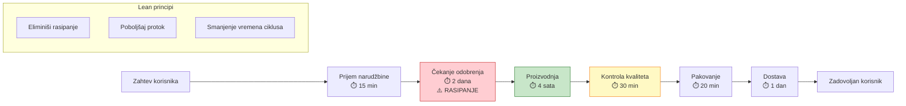
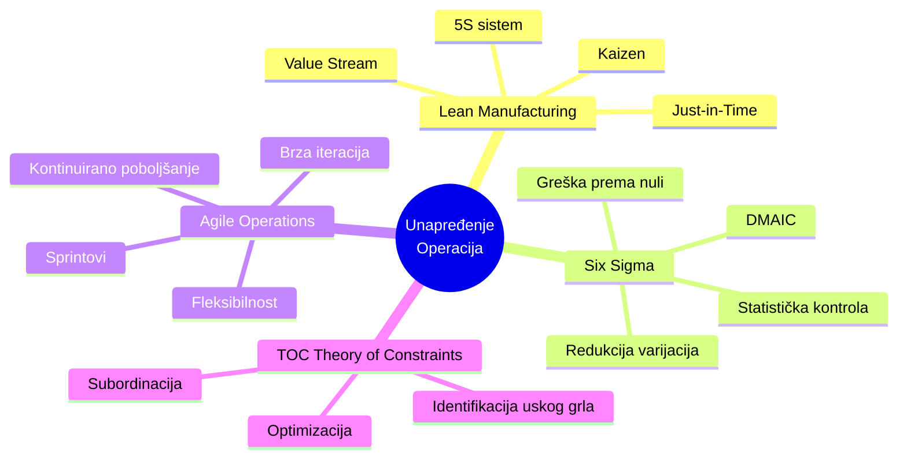
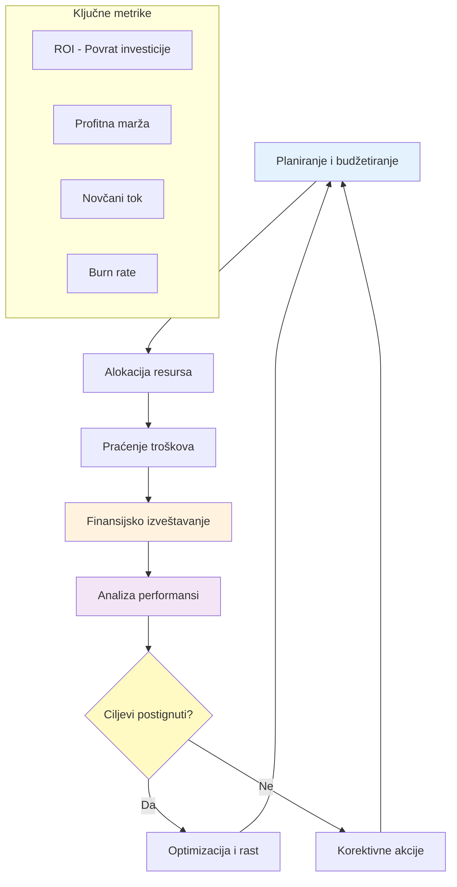
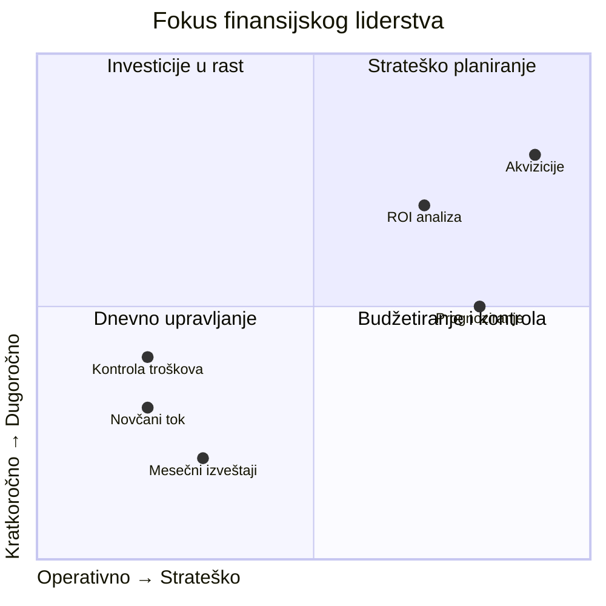

# 2. Organizacija i poslovanje (Organization and Business Operations)

Ova oblast kompetencija pokriva veštine potrebne za efikasno vođenje organizacije. Ona uključuje operativni menadžment, prodajne veštine, digitalni marketing, finansijsko upravljanje i upravljanje projektima. U suštini, ove veštine osiguravaju da se velika vizija izvršava efikasno i da biznis ostaje zdrav i konkurentan.

## Menadžment i upravljanje operacijama

**Snažno operativno upravljanje** je kičma svakog uspešnog biznisa. Ono uključuje dizajniranje efikasnih procesa, mudro upravljanje resursima i kontinuirano unapređivanje radnog toka. Lideri vešti u operacijama često primenjuju metodologije kao što su Lean ili Six Sigma da eliminišu rasipanje i optimizuju produktivnost.

### 📊 Vizualizacija: Value Stream Mapping (Mapiranje toka vrednosti)

**Metode unapređenja procesa:**

**Uticaj dobrog upravljanja operacijama:**

Organizacije koje naglašavaju operativnu izvrsnost (process excellence) rasipaju daleko manje resursa. **Studije pokazuju da loše upravljanje projektima i procesima može uzrokovati da kompanije izgube do 12% svojih resursa** – trošak koji većina biznisa ne može da priušti. Sa druge strane, efikasno upravljanje operacijama povećava profitabilnost i zadovoljstvo korisnika, i kreira stabilnu osnovu za rast.

**Kako razviti operativne veštine:**

Da razvijete operativne veštine, trebalo bi da:

1. **Naučite o mapiranju procesa i metrikama performansi**:
   - Identifikujte uska grla u vašim trenutnim radnim tokovima
   - Koristite alate kao što je **mapiranje toka vrednosti** (Value Stream Mapping)
   - Razmislite o rešenjima za eliminaciju rasipanja

2. **Upoznajte se sa osnovama upravljanja projektima** – Operacije često uključuju nadgledanje projekata ili inicijativa

3. **Dobijte relevantne sertifikacije**:
   - **Lean Six Sigma Green Belt** za metodologije unapređenja procesa
   - **PMP (Project Management Professional)** za formalne okvire upravljanja projektima

4. **Praktično iskustvo**:
   - Tražite rotacije ili privremene zadatke u ulogama fokusiranim na operacije
   - Oblasti: lanac snabdevanja, proizvodnja, logistika

5. **Obuka i radionice**:
   - Upisujte radionice fokusirane na upravljanje operacijama
   - Koristite online kurseve koji simuliraju operativne odluke (poslovne simulacije)

**Uloga mentora:**

Mentori u ovoj oblasti mogu uključivati iskusnog **COO-a ili operativnog menadžera** koji vas može naučiti:
- Balansiranju kvaliteta, troškova i brzine
- Implementaciji inicijativa za unapređenje
- Rešavanju uobičajenih operativnih izazova:
  - Problemi sa dobavljačima
  - Kontrola zaliha
  - Skaliranje procesa kako biznis raste

**Cilj:** Kultivisati način razmišljanja fokusiran na efikasnost i rešavanje problema. Kada se dobro uradi, efikasno upravljanje operacijama povećava profitabilnost i zadovoljstvo korisnika, i kreira stabilnu osnovu za rast.

## Prodajne veštine

Čak i ako niste u direktnoj prodajnoj ulozi, **prodajne veštine** su fundamentalne za liderstvo – jer se one zapravo svode na veštinu uticaja i ubeđivanja. Lideri "prodaju" ideje svojim timovima svakodnevno, bilo da je to dobijanje podrške za novu inicijativu ili inspirisanje ljudi da daju najbolje od sebe. Ključne kompetencije vezane za prodaju uključuju aktivno slušanje da zaista razumete potrebe drugih, efikasnu komunikaciju vrednosti, rukovanje prigovorima ili otporom, i zatvaranje posvećenosti (dobijanje od drugih da se slože oko pravca delovanja).

**Perspektiva liderstva:**

Zapravo, jedan liderski kouč je primetio: **"Lideri ne samo da upravljaju zadacima – oni inspirišu ljude da ih prate u nepoznato. A to zahteva prodajne veštine, u ljudskom smislu: duboko slušanje, slikanje slike onoga što je moguće, i dobijanje posvećenosti."**

**Kako praktično razviti prodajne veštine:**

1. **Osnovni slušanje i empatija**:
   - Napravite naviku postavljanja otvorenih pitanja
   - Sumirajte ono što čujete da osigurate razumevanje
   - Slušajte da razumete, ne da odgovorite

2. **Razvijte sposobnost pripovedanja (storytelling)**:
   - Formulišite vašu viziju ili zahtev kao ubedljivu priču
   - Umesto samo instruisanja tima, objasnite "zašto" iza toga
   - Povežite se sa njihovim motivacijama

3. **Proučavajte tehnike pregovaranja**:
   - Pomoći će vam i u eksternoj prodaji i u internom uticaju
   - Korisno za pregovaranje o resursima za vaš projekat

4. **Formalna obuka**:
   - Pohađajte prodajnu obuku (čak i osnovni kurs konsultativne prodaje)
   - Učite rukovanje prigovorima
   - Razumejte psihologiju kupaca/stejkholdera
   - Ove veštine su jednako primenljive kada "prevazilazite otpor" unutar vašeg tima

**Uloga mentorstva:**

**Mentorstvo može ubrzati vaš rast u prodajnoj sposobnosti.** Razmislite o pronalaženju mentora koji je vrhunski prodajni performer ili prodajno orijentisani rukovodilac. Praćenjem njih ili tražeći njihov savet, možete naučiti suptilnosti kao što su:
- Kako "čitati sobu"
- Kako prilagoditi vaš pristup različitim stejkholderima
- Kako ostati otporni pred odbijanjem

Neke organizacije sparuju nastajuće lidere sa prodajnim mentorima posebno da usade način razmišljanja fokusiran na korisnika i ubeđivanje. Takođe, praktikovanje ovih veština u realnim scenarijima (npr., volontiranje da predstavite predlog višem menadžmentu ili vođenje sastanka sa klijentom) i zatim dobijanje povratnih informacija od vašeg mentora ili kouča će značajno poboljšati vašu samopouzdanost i sposobnost.

**Zapamtite:** Cilj nije postati "prodajno orijentisan" u stereotipnom smislu, već da se **istinski povežete sa potrebama drugih i pokažete kako vaša ideja (ili proizvod/usluga) ispunjava te potrebe** – osnovna liderska veština.

## Digitalni marketing

U današnjem digitalnom dobu, lideri imaju koristi od razumevanja **digitalnog marketinga** – čak i ako to nije njihov primarni posao – jer je on ključan za dosezanje klijenata i rast biznisa. Digitalni marketing obuhvata kanale kao što su društvene mreže, pretraživači, email i content marketing. To je oblast vođena podacima gde se strategije mogu prilagoditi u realnom vremenu zasnovano na analitici.

"Uspešni digitalni marketeri trebaju jake komunikacijske veštine, stručnost u analizi podataka i solidno razumevanje dinamike društvenih mreža da bi kreirali ubedljive marketinške narative."

U praksi, razvijanje veština digitalnog marketinga može značiti učenje kako funkcioniše SEO (optimizacija za pretraživače), razumevanje osnova onlajn reklamiranja (npr. Google Ads, Facebook Ads), ili poznavanje kako da angažujete publiku na platformama kao što su LinkedIn ili Instagram. Kao lider, ne morate nužno biti osoba koja izvršava kampanje, ali trebalo bi da budete vešti u metrikama digitalnog marketinga (kao što su stope konverzije, stope kliktanja, troškovi akvizicije korisnika) da biste donosili informisane odluke i postavljali prava pitanja vašem marketinškom timu.

Da se poboljšate u ovoj oblasti, možete pohađati onlajn kurseve ili sertifikacije u digitalnom marketingu (Google, HubSpot ili HBS Online nude dobro poznate programe). Takođe možete eksperimentisati direktno: na primer, vođenjem male kampanje na društvenim mrežama za sporedni projekat ili pisanjem nekoliko blog postova i praćenjem njihovog saobraćaja da naučite o content strategiji.

## Finansijsko upravljanje

**Finansijsko upravljanje** je ključna liderska veština koja uključuje planiranje, organizovanje i kontrolu finansijskih resursa. Kao što jedna poslovna maksima kaže: "Biznis ne može da raste i napreduje kada je njegov finansijski kućni poredak u neredu." Snažno finansijsko upravljanje vam daje kontrolu nad zdravljem kompanije – osiguravajući da imate novčani tok da poslujete i profitabilnost da održite rast. Ono obuhvata sve od budžetiranja i prognoziranja, do analize finansijskih izveštaja, do donošenja investicionih odluka, do upravljanja rizicima.

### 📊 Vizualizacija: Ciklus finansijskog upravljanja

**Četiri stuba finansijskog upravljanja:**

Lideri ne moraju svi biti računovođe, ali im je potrebna finansijska pismenost. Zapravo, kompanije koje konzistentno prate i upravljaju svojim finansijama "nalaze glatkiji put ka rastu i profitabilnosti" jer mogu brzo korigovati kurs i alocirati resurse tamo gde su najpotrebniji.

Da izgradite veštine finansijskog upravljanja, počnite učenjem čitanja finansijskih izveštaja (bilans uspeha, bilans stanja, izveštaj o novčanom toku) i razumevanjem ključnih metrika (kao što su ROI, marža, burn rate u startapovima, itd.). Ako već niste, razmislite o osnovnom kursu finansija – mnoge poslovne škole i onlajn platforme nude obuku "Finansije za nefinansijske menadžere". Interno, uključite se u budžetsko planiranje za vaš tim ili odeljenje; to je veoma praktičan način da naučite, čak i ako su budžeti mali.

Takođe pokušajte koristiti finansijske podatke u donošenju odluka: na primer, izvedite analizu troškova i koristi za projekat, ili kalkulirajte ROI predloženog programa obuke. Moćan način da rastete je da imate mentora u finansijskoj oblasti, kao što je CFO ili finansijski analitičar, koji može pregledati vaš budžet ili predloge sa vama. Oni vas mogu naučiti kako da uočite crvene zastavice u finansijama ili kako da opravdate ideju u finansijskim terminima višem menadžmentu.

## Upravljanje projektima

**Upravljanje projektima** je sposobnost da planirate i izvršavate projekte na vreme i prema budžetu, dok postižete namenjene ishode. To je esencijalna kompetencija za pretvaranje ideja u realnost. Dobro upravljanje projektima podrazumeva postavljanje jasnih ciljeva, organizovanje plana sa vremenskim rokovima i odgovornostima, efikasnu komunikaciju sa stejkholderima, i upravljanje rizicima i promenama tokom puta.

Bez ovih veština, čak i briljantne strategije mogu zapeti – zaista, studije su otkrile da nedostatak jasnih ciljeva i vizije je najčešći faktor u neuspesima projekata (primećen u 37% neuspelih projekata). Obrnuto, organizacije koje ulažu u solidne prakse upravljanja projektima vide mnogo veće stope uspeha.

Na primer, korišćenje agilnog pristupa i osiguravanje brzog donošenja odluka može dramatično povećati uspeh projekta. Jedna studija je pokazala da kada liderstvo donosi projektne odluke za <1 sat, stope uspeha projekta su oko 58%, ali ako donošenje odluka se odugovlači na ~5 sati, uspeh pada na samo 18%. Ovo naglašava kako agilna, osnažena projektna okruženja nadmašuju spora, rigidna okruženja.

Da postanete bolji menadžer projekta, upoznajte se sa metodologijama kao što su PMI-jeva PMBOK (Project Management Body of Knowledge) ili PRINCE2, i naročito naučite Agile/Scrum okvire (pošto je agile sada vrlo rasprostranjen za mnoge tipove projekata). Praktično, možete volontirati da vodite male projekte da biste stekli iskustvo – čak i koordinacija timske inicijative ili događaja može naučiti planiranju, delegiranju zadataka i praćenju.

Koristite alate za upravljanje projektima (Trello, Asana, MS Project, itd.) da ostanete organizovani i dobijete izloženost tome kako oni olakšavaju timsku komunikaciju i praćenje. Razmislite o dobijanju sertifikacije kao što je PMP ili Certified ScrumMaster (CSM) – ne samo da ćete naučiti najbolje prakse, već sertifikacija signalizira vašu kompetenciju.

## Praktični saveti za razvoj

Za set veština Organizacije i Poslovanja, jedan zajednički komad saveta je da budete što je bliže mogućnosti akciji. Upravljanje operacijama ili projektima sa distance neće naučiti koliko će to podizanje rukava i suočavanje sa stvarnim problemima. Ako ste u specijalizovanoj ulozi, pokušajte da sarađujete sa drugim odeljenjima kao što su finansije ili marketing da vidite veću operativnu sliku.

Prihvatite metrike i table sa podacima – "ono što se meri se i upravlja." Ključni indikatori performansi (KPI) u oblastima kao što su operativna efikasnost, prodajne konverzije ili napredak projekta će vam pomoći da kvantifikujete uspeh i ranije uočite probleme.

Takođe, razmislite o pridruživanju profesionalnim udruženjima (npr. Project Management Institute za menadžere projekata, ili lokalnim poslovnim odeljcima za operativne i prodajne profesionalce). Oni često imaju radionice, umrežavanje i programe mentorstva.

Zapamtite da finansijska sposobnost često razlikuje vrhunske rukovodioce – tako da čak i ako brojke nisu vaš omiljeni deo, radite da postanete ugodni sa finansijskim podacima; to će vas izdvojiti. Još jedan savet je da tražite 360-stepenu povratnu informaciju od kolega o ovim veštinama. Na primer, pitajte vaš tim za input o vašem pristupu upravljanju projektima ili vašoj komunikaciji u operativnim stvarima.

Konstruktivna povratna informacija pomaže u identifikovanju slepih tačaka koje treba poboljšati. Na kraju, koristite tehnologiju u svoju korist: moderni softver može automatizovati rutinske zadatke (štediti vreme – 54% radnika veruje da automatizacija može da im uštedi 5+ sati nedeljno) i poboljšati komunikaciju (timovi koji koriste projektni softver imaju u proseku 52% bolju timsku komunikaciju).

Obučavajući se na ovim alatima i ostajući ažurirani o tech trendovima (kao što je AI u upravljanju projektima), održavate svoj set operativnih veština na ivici. Ukratko, postanite doživotni student toga kako se posao obavlja – rafinirajte, iterirajte i učite iz svakog projekta ili procesa. Vremenom, izgradit ćete reputaciju kao efikasan, vođen rezultatima lider koji može da pretvori planove u opipljive ishode.
