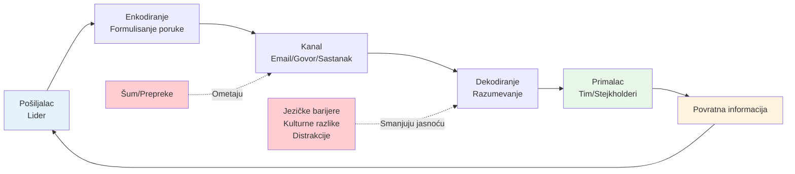
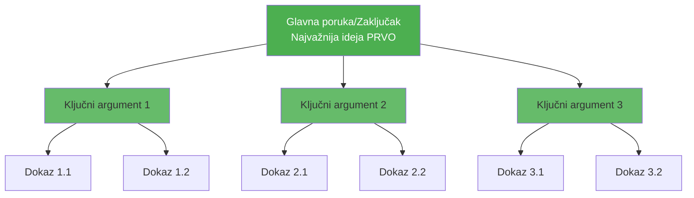
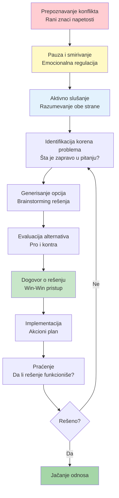
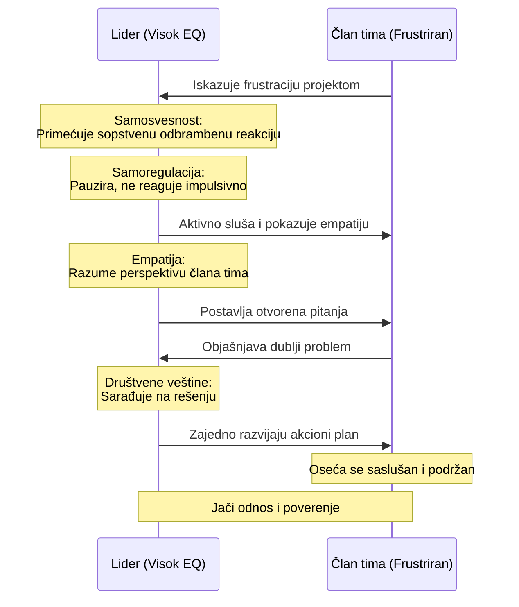

# 3. Komunikacija i saradnja (Communication and Collaboration)

Nijedan lider ne uspeva sam; sposobnost da radite sa i kroz druge je od najveće važnosti. Ova kompetencija uključuje komunikacione veštine, aktivno slušanje, rešavanje konflikata, fasilitaciju i emocionalnu inteligenciju. Ovo su "soft skills" po imenu ali teške za savladavanje – ipak direktno utiču na timski moral, inovaciju i produktivnost. Razvijanje ovih veština će vam pomoći da izgradite visokoperformanse timove i pozitivnu organizacionu kulturu.

## Komunikacione veštine

**Jasna i efektivna komunikacija** je lepak koji drži timove na okupu. Lideri moraju prenositi ideje, očekivanja i povratne informacije na načine koje ljudi razumeju i pamte. Snažne komunikacijske veštine uključuju ne samo jasno govorenje i pisanje, već i prilagođavanje poruke publici i korišćenje pravog tona. Istraživanja konzistentno pokazuju da dobra komunikacija korelira sa boljom timskom performansom – na primer, Harvard studija je otkrila da jasna, dobro struktuirana komunikacija može poboljšati efikasnost međufunkcionalnog tima za 40%.

### 📊 Vizualizacija: Model efektivne komunikacije



**Piramidalni princip strukture komunikacije:**



Da poboljšate svoju komunikaciju, vežbajte organizovanje vaših misli (razmislite o korišćenju okvira kao što je Piramidalni Princip za prezentacije ili SCR (Situacija-Komplikacija-Rezolucija) metoda za emailove). Uvek ciljajte na jasnoću i sažetost; zaposleni kolege će ceniti koncizne poruke. Neverbalna komunikacija je takođe ključna: budite svesni vašeg jezika tela i izraza lica, jer oni mogu ili pojačati ili potkopati vaše reči.

Jedna strategija je traženje povratne informacije o vašem stilu komunikacije – pitajte kolege da li vaše instrukcije ili vizija jasno dolaze. Oni mogu istaći žargon koji preterano koristite ili vam reći da li izgledate nepristupačno. U liderskim ulogama, pripovedanje je moćna veština – ono transformiše dosadne podatke u ubedljiv narativ. Radite na ubacivanju priča ili stvarnih primera kada komunicirate promene ili ciljeve; to čini vašu poruku lepljivom.

Mentori mogu pomoći rafiniranju komunikacijskih veština igranjem teških razgovora sa vama ili pregledom važnih komunikacija (kao što su važni emailovi ili govorni punktovi za town-hall sastanke) i sugerišući poboljšanja. Takođe, razmislite o formalnoj obuci kao što su radionice o javnom govorenju, kursevi poslovnog pisanja ili komunikacijski kouč ako je prikladno.

## Aktivno slušanje

**Aktivno slušanje** je praksa potpunog koncentrisanja na ono što drugi kažu, razumevanja i njihovih reči i osnovne poruke, i pokazivanja da ste angažovani. Zvuči jednostavno, ali istinsko aktivno slušanje je "iznenađujuće izazovno potpuno shvatiti, čak i za iskusne komunikatore".

Za lidere, aktivno slušanje gradi poverenje i otkriva dragocene informacije – na kraju krajeva, ne možete efikasno voditi ako niste usklađeni sa povratnim informacijama, brigama ili idejama vašeg tima. Iznenađujuće, do 80% problema na radnom mestu potiče od loše komunikacije, a značajan deo toga je zbog ljudi koji ne osećaju da su saslušani.

Poboljšanje aktivnog slušanja uključuje nekoliko konkretnih ponašanja: obratite punu pažnju (izbegavajte višezadatnost ili formulisanje vašeg odgovora dok druga osoba govori), pružite priznanja (klimanje, recite "mm-hmm" ili "vidim"), postavljajte pitanja za pojašnjenje, i parafrazirajte ili sumirajte ono što ste čuli da osigurate razumevanje.

Menadžeri obučeni u aktivnom slušanju su videli opipljive koristi – jedan izveštaj je otkrio da su menadžeri koji su primili obuku u aktivnom slušanju videli 30% poboljšanje u zadovoljstvu zaposlenih, a timovi sa liderima koji aktivno slušaju uživali su do 25% povećanje u saradnji i produktivnosti. To su ogromni dobici od "soft" veštine.

Da praktikujete, možete namerno fokusirati se na slušanje u vašem sledećem jedan-na-jedan sastanku radeći više sumiranja ("Dakle, ako razumem, vaša glavna briga je X, tačno?"). Oduprite se poruci da odmah rešavate ili sudite; ponekad samo slušanje i priznavanje osećanja ("Mogu zamisliti da je to bilo frustrirajuće") je dovoljno.

Razmislite o učenju od mentora ili kouča koji primjenjuje sjajno slušanje. Možete posmatrati kako oni vode sastanke ili teške razgovore – primetite njihovu otvorenu telesnu posturu, kako prave pauzu da bi drugi govorili, i kako validiraju tuđi input. Neke kompanije uključuju obuku za koučing za menadžere koja često naglašava slušanje kao kod kouč (korišćenjem tehnika kao što su moćna pitanja i refleksivno slušanje).

## Rešavanje konflikata

**Konflikt na radnom mestu je neizbežan** – različite perspektive, ciljevi ili stilovi mogu se sukobiti. Ono što izdvaja efikasne lidere je kako oni rukuju tim konfliktima. Dobro rešavanje konflikta ne znači izbegavanje konflikta u potpunosti (što može dovesti do potisnutih problema i negodovanja); to znači suočavanje sa neslaganjima konstruktivno i brzo tako da odnosi i saradnja zapravo izlaze jači.

### 📊 Vizualizacija: Proces rešavanja konflikta



**Pet stilova rešavanja konflikata:**

```mermaid
quadrantChart
    title Stilovi rešavanja konflikta
    x-axis Niska asertivnost → Visoka asertivnost
    y-axis Niska kooperativnost → Visoka kooperativnost
    quadrant-1 Kolaboracija: Win-Win
    quadrant-2 Akomodacija: Ustupanje
    quadrant-3 Izbegavanje: Odlaganje
    quadrant-4 Kompromis: Srednji put
    Kolaboracija: [0.9, 0.9]
    Kompeticija: [0.9, 0.1]
    Akomodacija: [0.1, 0.9]
    Izbegavanje: [0.1, 0.1]
    Kompromis: [0.5, 0.5]
```

Loše upravljan konflikt ima ozbiljne negativne strane: ankete ukazuju da je 88% zaposlenih videlo konflikte koji ugrožavaju moral, a 18% je čak videlo projekte koji direktno propadaju zbog nerešenog konflikta. Sa druge strane, kada se dobro upravlja, konflikt može dovesti do "poboljšanih radnih odnosa, boljeg razumevanja drugih, pa čak i kreativnih rešenja", sa preko 50% ljudi koji priznaju ove pozitivne ishode dobro upravljanog konflikta.

Da poboljšate svoje veštine rešavanja konflikata, počnite učenjem da prepoznate rane znake konflikta (npr. napetost u sastancima, pasivno-agresivni komentari, formiranje klika) i intervenišite rano pre nego što se stvari ugnezde. Obuka u osnovnoj medijaciji ili ključnim razgovorima može vas opremiti tehnikama – kao što je fokusiranje na problem a ne na osobu, traženje zajedničke osnove i generisanje win-win opcija.

Takođe je kritično održavati emocionalnu smirenost; ako vi kao lider izgubite hladnokrvnost, konflikt često eskalira. Jedan koristan pristup je da okvire konflikte kao probleme koji se rešavaju zajedno umesto bitaka koje se dobijaju. Na primer, ako se dva odeljenja bore oko resursa, dovedite ih zajedno da redefinišu problem ("Kako možemo optimizovati korišćenje resursa da ispunimo ključne potrebe oba tima?") umesto uzimanja strana.

## Veštine fasilitacije

**Fasilitacija** je sposobnost da vodite grupe kroz efikasne diskusije, procese donošenja odluka ili radionice. Lider sa veštinama fasilitacije može učiniti timske sastanke produktivnijim, osigurati da je svačiji glas čut i pomoći timu da dođe do konsenzusa ili kreativnih ideja. Fasilitacija uključuje neutralnost (ostajanje objektivnim ako vodite diskusiju), aktivno slušanje (da sumirate i spajate različite tačke gledišta), i poznavanje kutije alata tehnika (kao što su metode brainstorminga, vežbe prioritizacije ili tehnike medijacije konflikata za zagrejane diskusije).

Izgradnja veština fasilitacije je posebno korisna u međufunkcionalnim timovima ili bilo kojem scenariju gde vodite kroz uticaj umesto autoriteta. Da praktikujete fasilitaciju, možete volontirati da vodite sastanak o komplikovanoj temi i svesno primenite fasilitacione tehnike: počnite postavljanjem jasnih osnovnih pravila, koristite otvorena pitanja da izvučete tiše članove, upravljajte dominantnim govornicima diplomatski (npr. "Hvala, čujmo nekoga ko još nije govorio"), i sumirajte periodično ono što je grupa rekla.

Takođe je važno kreirati sigurno okruženje gde se ljudi osećaju ugodno da dele iskreno. Vodeće kompanije naglašavaju psihološku sigurnost – "radno mesto gde je svačiji glas važan i ljudi neće biti kažnjeni ili ismevani za govorenje". Kao fasilitator, negujete ovo ohrabrujući poštovano slušanje i validiranjem doprinosa.

## Emocionalna inteligencija

**Emocionalna inteligencija**, često skraćeno kao EQ, je sposobnost da prepoznate i upravljate svojim sopstvenim emocijama, kao i da razumete i utičete na emocije drugih. Široko se smatra kritičnom liderskom veštinom – neki kažu da IQ možda može da vas zaposli, ali EQ vas promovise. Visoka emocionalna inteligencija pomaže liderima da ostanu smireni pod pritiskom, saosećaju sa članovima tima i navigiraju društvenom kompleksnošću na radnom mestu.

### 📊 Vizualizacija: Pet stubova emocionalne inteligencije

```mermaid
graph TD
    EQ[Emocionalna Inteligencija]

    EQ --> SA[Samosvesnost<br/>Self-Awareness]
    EQ --> SR[Samoregulacija<br/>Self-Regulation]
    EQ --> M[Motivacija<br/>Motivation]
    EQ --> E[Empatija<br/>Empathy]
    EQ --> SS[Društvene veštine<br/>Social Skills]

    SA --> SA1[Prepoznavanje emocija]
    SA --> SA2[Razumevanje uticaja]
    SA --> SA3[Samoprocena]

    SR --> SR1[Kontrola impulsa]
    SR --> SR2[Adaptabilnost]
    SR --> SR3[Upravljanje stresom]

    M --> M1[Postignuće]
    M --> M2[Inicijativa]
    M --> M3[Optimizam]

    E --> E1[Razumevanje drugih]
    E --> E2[Razvoj drugih]
    E --> E3[Orijentacija ka služenju]

    SS --> SS1[Uticaj i inspiracija]
    SS --> SS2[Komunikacija]
    SS --> SS3[Upravljanje konfliktima]
    SS --> SS4[Izgradnja timova]

    style EQ fill:#9c27b0,color:#fff
    style SA fill:#e1bee7
    style SR fill:#ce93d8
    style M fill:#ba68c8
    style E fill:#ab47bc
    style SS fill:#8e24aa,color:#fff
```



**EQ u akciji - Scenario rešavanja problema:**



Ona obuhvata kompetencije kao što su samosvesnost, samoregulacija, motivacija (biti vođen da postignete izvan novca/statusa), empatija i društvene veštine (izgradnja rapporta, uticaj, upravljanje konfliktima). Postoje jake dokaze koji povezuju emocionalnu inteligenciju sa poslovnim ishodima: lideri sa visokim EQ-om imaju tendenciju da imaju angažovanije timove i bolje poslovne rezultate.

Jedna studija od strane Catalyst-a je otkrila da lideri koji demonstriraju empatiju i razumevanje mogu povećati inovaciju i produktivnost među svojim timovima – verovatno zato što zaposleni osećaju da su sigurni i cenjeni, što oslobađa njihov najbolji rad.

Da poboljšate emocionalnu inteligenciju, počnite sa samosvesnošću. Obratite pažnju na vaše emocionalne okidače i reakcije: na primer, koje situacije vas čine nestrpljivim ili stresiranim? Vodite dnevnik ili koristite aplikaciju za praćenje raspoloženja ako to pomaže. Prakse svesnosti (meditacija, vežbe dubokog disanja) mogu povećati vašu svesnost o emocijama u trenutku i dati vam tu podeljenu sekundu pauze da izaberete svoj odgovor umesto da reagujete impulsivno.

Zatim, radite na empatiji. Napravite naviku da razmatrate tuđe perspektive – ako kolega ne uspeva, pre nego što preskočite na presudu, zapitajte se šta bi moglo da se dešava u njihovom svetu (Da li su preopterećeni? Suočavaju se sa ličnim izazovom?). Možete čak vežbati ovo izvan posla – na primer, aktivno slušajući prijatelja bez da odmah nudite svoju priču.

## Praktični saveti za razvoj

U domenu Komunikacije i Saradnje, konzistentnost i autentičnost su ključni. Nije dovoljno izgledati kao da slušate ili se pretvarate da vam je stalo – timovi brzo osete neiskrenost. Istinski investirajte u svoje ljudske veštine. Evo nekoliko akcionih saveta:

1. **Angažujte se u aktivnim ciklusima povratnih informacija**: Nakon važnih sastanaka ili teških razgovora, razmislite šta je prošlo dobro i šta nije. Možete čak pitati kolegu koji je bio prisutan da podeli svoja zapažanja – možda ste propustili signal da je neko uznemiren jer ste bili fokusirani drugde.

2. **Igrajte uloge izazovnih interakcija**: Ako anticipirate težak razgovor (kao što je pitanje performansi ili pregovaranje između sukobljenih članova tima), vežbajte sa mentorom ili prijateljem. Ovo gradi mišićnu memoriju za rukovanje tim mirno i sa poštovanjem.

3. **Kreirajte kanale za otvorenu komunikaciju**: Na primer, imajte redovne "kancelarijske sate" ili Q&A sesije gde članovi tima mogu izraziti brige ili ideje. Osigurajte da odgovarate sa zahvalnošću za njihov input, čak i ako ne možete da ispunite svaki zahtev. Ovakva otvorenost demonstrira da cenite saradnju i da niste diktator odozgo nadole.

4. **Priznajte i slavite kolaborativno ponašanje**: Javno priznajte kada članovi tima primenjuju sjajnu komunikaciju ili timski rad – postavlja ton da su ove veštine deo visokih performansi.

5. **Učite iz konflikata koji su dobro rešeni i onih koji nisu**: Sprovođenje post-mortem-a nakon što se konflikt reši – šta se moglo učiniti ranije da se spreči? Da li su se svi osećali da je rezolucija pravedna? Ova refleksija će poboljšati vaše liderstvo konflikta tokom vremena.

I možda najvažnije, **radite na izgradnji poverenja**. Poverenje je osnova dobre komunikacije i saradnje. Bez poverenja, čak i najbolje odabrane reči će biti sumnjičave. Izgradnja poverenja može uključivati ispunjavanje obećanja, biti transparentan sa informacijama i priznati greške (što je moćan način da humanizujete sebe i pokažete integritet).

Zapamtite Deloitte-ov nalaz navedeno gore: kada zaposleni osećaju osećaj pripadnosti (ključni ishod inkluzivne komunikacije i izgradnje poverenja), to vodi do 56% povećanja performansi posla i 50% smanjenja rizika od fluktuacije. Ti brojevi ilustruju ROI ulaganja u ove soft skills. Kontinuiranim poboljšanjem načina na koji se povezujete sa drugima – kroz slušanje, saosećanje, rešavanje trenja i inspirisanje – ne postajete samo omiljen lider, već onaj koji može iskoristiti pune talente vašeg tima, što je konačni multiplikator snage.
