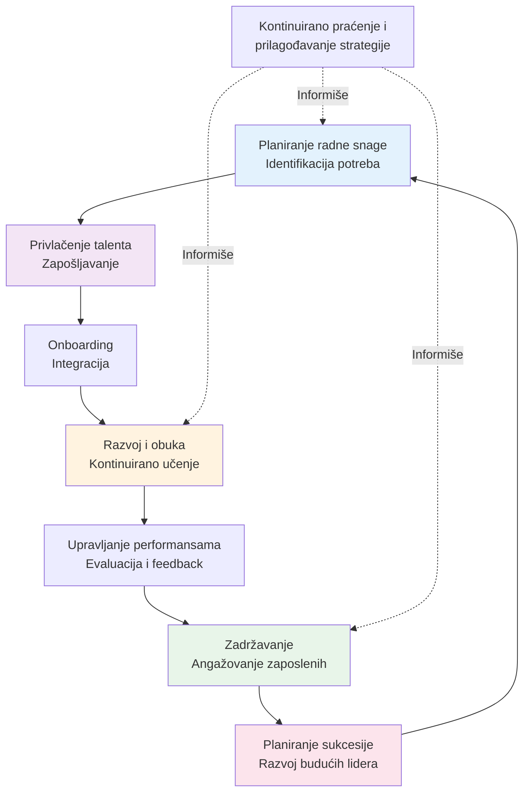
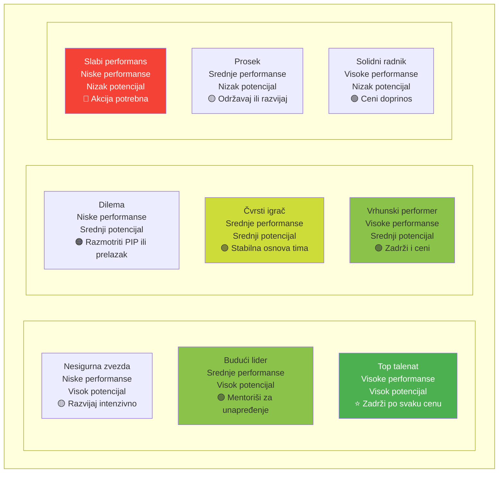

# 4. Edukacija i razvoj (Education and Development)

Ova oblast kompetencija se bavi razvijanjem ljudi – upravljanjem talentima, dizajniranjem programa obuke, održavanjem tehničke ekspertize i budžetiranjem za učenje. U svetu koji se brzo menja, lideri moraju biti šampioni kontinuiranog učenja za sebe i svoje timove. Veštine ovde osiguravaju da možete privući, razviti i zadržati talent potreban za izvršavanje vaše vizije. Takođe se radi o izgradnji kulture učenja gde je unapređenje konstantno.

## Upravljanje talentima

**Upravljanje talentima** uključuje strateško privlačenje, razvijanje i zadržavanje zaposlenih sa pravim veštinama i potencijalom da ispune organizacione ciljeve. Ono uključuje planiranje sukcesije, razvoj performansi, mapiranje karijere i ponekad čak upravljanje znanjem (osiguravanje da se kritičan know-how hvata i prenosi). U periodima promena ili rasta, upravljanje talentima je posebno vitalno – zanemarite ga, i možete videti egzodus ključnih ljudi.

### 📊 Vizualizacija: Ciklus upravljanja talentima

**9-Box Grid za procenu talenta:**

Istraživanje istaknuto u Harvard Business Review upozorava da stope atricije mogu se udvostručiti nakon većih promena kao što je akvizicija ako zaposleni osećaju neizvesnost oko svog razvoja i budućnosti. Efikasno upravljanje talentima tome se suprotstavlja pružanjem jasnoće i prilika.

Da se poboljšate u upravljanju talentima, lideri bi trebali početi razumevanjem aspiracija i snaga svojih ljudi. Vodite karijerske razgovore: pitajte članove tima gde žele da idu i kako im možete pomoći da tamo stignu. Upoznajte se sa alatima kao što su 9-box gridi (za procenu performansi naspram potencijala) ili pregledi talenata koje mnoga HR odeljenja sprovode.

Ako vaša organizacija nema formalne procese, još uvek možete vežbati neformalno – na primer, identifikujte osobu sa visokim potencijalom u vašem timu i svesno kreirajte mini razvojni plan za njih (rotirajte ih u izazovan zadatak, dodelite im mentora, itd.). Takođe, investirajte vreme u mudro zapošljavanje, pošto dovođenje pravih ljudi na bord je prvi korak upravljanja talentima.

Koristan pristup je uključivanje vašeg tima u regrutovanje – ne samo da dobijate različite perspektive o kandidatima, već takođe signalizirate vašem timu da cenite njihov input u oblikovanju tima. Mentorstvo igra dvostruku ulogu ovde: kao lider, možete biti mentor rastućem talentu, a možete takođe imati mentore koji vas vode o tome kako upravljati talentom.

Za ovo poslednje, mentor bi mogao biti iskusni HR lider ili rukovodilac poznat po izgradnji snažnih timova, koji može savetovati o teškim pitanjima kao što je motivacija slabih performera ili zadržavanje zvezda zaposlenih sa ograničenim mestima za promociju.

## Dizajn programa obuke

**Dizajn programa obuke i razvoja** je specifična veština unutar upravljanja talentima koja se fokusira na to kako efikasno unaprediti vašu radnu snagu. To znači procenu potreba za obuku, kreiranje ili kuriranje sadržaja, odlučivanje o formatima (radionica, e-learning, obuka na poslu) i evaluaciju uticaja obuke. Dobro dizajniran program obuke može značajno poboljšati performanse i popuniti praznine u veštinama.

Angažujuća obuka takođe korelira sa produktivnošću – na primer, Gallup istraživanje je pokazalo da efikasna obuka može povećati produktivnost za oko 21%.

Da postanete bolji u ovome, počnite sa procenom potreba: identifikujte koje praznine u znanju ili veštinama koče vaš tim ili organizaciju od postizanja ciljeva. To bi moglo biti učinjeno kroz ankete, podatke o performansama ili jednostavno pitajući zaposlene šta bi voleli da budu bolji u tome. Zatim, upoznajte se sa principima dizajna učenja: odrasli najbolje uče kada je sadržaj relevantan, interaktivan i odmah primenjiv.

Tako je savet da uključite praksu iz stvarnog sveta u bilo koju obuku (studije slučaja, simulacije, praktične vežbe) umesto samo predavanja. Takođe razmislite o iskorišćavanju interne ekspertize – ponekad su najbolji treneri vaši sopstveni stručnjaci. Ako imate sjajnog programera u timu, možda oni mogu voditi kliniku kodiranja za druge.

Za formalnije dizajniranje, možete koristiti ADDIE model (Analyze, Design, Develop, Implement, Evaluate) kao okvir za kreiranje strukturisanih programa. Danas su mikro-učenje (kratki moduli veličine zalogaja) i mešovito učenje (mešavina onlajn i uživo) popularni i često su probavljivi za zaposlene zaposlene.

Tražite pomoć od mentora ili profesionalnih instrukcijskih dizajnera ako su dostupni. Mentor sa iskustvom u L&D (Learning & Development) može vas voditi o tome kako meriti ROI obuke ili kako dobiti podršku liderstva za razvojnu inicijativu (povezivanjem je sa poslovnim ishodima).

## Tehnička ekspertiza

U zavisnosti od vaše oblasti, **održavanje tehničke ekspertize** je važno za kredibilitet i efikasno donošenje odluka. Tehnička ekspertiza znači da imate dubinsko znanje u vašem domenu – za softverskog lidera, to može biti ostajanje u toku sa programskim jezicima ili arhitektonskim principima; za marketing lidera, možda razumevanje najnovijih SEO algoritama ili marketing analitike; za inženjerskog menadžera, moglo bi biti poznavanje novih materijala ili dizajnerskih tehnika.

Lideri ne mogu da priušte da potpuno odvoje od realnosti "shop floor" ili detalja posla. Ako izgubite svo tehničko razumevanje, rizikujete donošenje loših odluka ili gubljenje poštovanja vašeg tima. Ipak, kako napredujete, često se oslanjate na svoje stručnjake za detalje – trik je znati dovoljno da postavite prava pitanja i da ne budete lako prevaren.

Da održite svoje tehničke veštine oštrima, posvetite se kontinuiranom učenju za sebe. Odvojite neko vreme svake nedelje ili meseca za učenje – bilo da se radi o čitanju industrijskih časopisa, pohađanju naprednog kursa ili bavlenju malim sporednim projektom. Mnoge profesije imaju zahteve za kontinuiranu edukaciju; čak i ako vaša nema, nametnite jedan sebi.

Postavite ciljeve učenja, kao što je "naučiti X novi softverski alat do kraja kvartala" ili "prisustvovati Y konferenciji/radionici ove godine". Podsticajte kulturu učenja tako što ćete to činiti javno – kada članovi tima vide da vi učite, sledit će vas. Iskoristite interne i eksterne mentore ovde takođe: Identifikujte nekoga ko je apsolutni guru u tehničkoj oblasti sa kojom ste manje poznati, i pitajte da li bi bili voljni da vas podučavaju ili povremeno brifuju.

Na primer, ako ste menadžer proizvoda koji želi bolje razumeti AI, pronađite data scientista koji može razbiti osnove za vas. Obrnuto, mogli biste mentorište ih o nečemu što znate dobro – uzajamno mentorstvo. Još jedna tehnika je "obrnuto mentorstvo" (takođe gore pomenuto) gde mlađi zaposleni mentoriše starijeg o novoj tehnologiji ili trendu. Ovo ne samo da pomaže starijoj osobi da nauči, već takođe osnažuje mlađe osobe – win-win za razvoj i zajednicu.

## Upravljanje budžetom za obuku

**Praktičan aspekt edukacije i razvoja je upravljanje budžetom** za to. Obuka i razvoj zahtevaju investiciju bilo da je to novac za eksterne kurseve, putovanje na konferencije ili slobodno vreme za zaposlene da uče. Lideri često se suočavaju sa izazovom zalaganja za dovoljne resurse za obuku i onda mudre alokacije tih resursa. S obzirom da su budžeti konačni, treba da priorizizirate najuticajnije razvojne aktivnosti.

Da se poboljšate u ovome, počnite razumevanjem poslovnog slučaja za razvoj: povežite zahteve za obuku sa očekivanim poboljšanjima u performansama ili mitifikacijom rizika. Na primer, ako želite budžet da obučite ceo tim o sajber sigurnosti, okvir te to u terminima smanjenja rizika od skupih sigurnosnih proboja.

Podaci mogu biti ubedljivi: 86% HR menadžera kaže da je obuka kritična za zadržavanje, a troškovi fluktuacije mogu daleko premašiti troškove obuke. Koristite statistike kao ove da podržite vaše budžetske zahteve. Takođe, zaposleni veoma cene prilike za razvoj (što se vezuje za zadržavanje, kao što je navedeno).

Jednom kada imate budžet, upravljajte njime kao portfolio investicija. Pratite potrošnju i ishode – na primer, ako ste potrošili $10,000 na timsku obuku van lokacije, koje su se promene dogodile? Možda su rezultati zadovoljstva korisnika poboljšani ili ste završili projekte brže; dokumentujte te pobede. Ako određene obuke pokazuju malo koristi, preusmite sredstva onima koje to čine.

Takođe razmislite kreativne načine da proširite budžet: grupne sesije obuke (dovođenje trenera na lokaciju može biti jeftinije po glavi nego slanje pojedinaca napolje), iskorišćavanje besplatnih ili jeftanih onlajn kurseva ili postavljanje peer-to-peer sesija obuke interno (koje košta samo vreme koje ljudi ulože).

## Praktični saveti za razvoj

Za kompetenciju Edukacije i Razvoja, jedna sveobuhvatna preporuka je izgraditi **kulturu učenja** u vašoj sferi uticaja. Podsticajte vaš tim da vidi učenje kao deo posla, a ne dodatak. Možete to učiniti uključivanjem ciljeva učenja u preglede performansi, slavljenjem postignuća u učenju (kao što je završavanje sertifikata) i čak dozvoljavanjem povremenog "20% vremena" za učenje (ako je Google famozno dozvolio inženjerima da koriste 20% svog vremena za inovativne sporedne projekte, možda ne možete upravljati sa 20%, ali čak i 5% vremena za razvoj veština može pomoći).

Takođe, ne zaboravite na razvoj na poslu, koji često je efektivniji od učioničke obuke. Tehnike kao što su rotacije posla, stretch zadaci ili prilike za "shadowovanje" koštaju malo i uče mnogo. Na primer, rotiranje zaposlenog sa visokim potencijalom kroz različito odeljenje za 3 meseca može proširiti njihovo razumevanje biznisa i razviti nove veštine. Kao lider, olakšajte ove pokrete kada je moguće čak i ako to znači gubljenje zvezde igrača na neko vreme, često se isplati u zadržavanju i ukupnoj sposobnosti.

Još jedan savet je **meriti i komunicirati ishode razvojnih napora**. Pratite metrike kao što su stope promocija internih kandidata (zdrav indikator razvoja) ili poboljšanja u ključnim veštinama merena kroz procene pre/posle obuke. Kada predstavite takve podatke višem menadžmentu, jača slučaj za održavanje ili povećanje razvojnih budžeta.

Ubedljiva statistika za citiranje: kompanije koje se ističu u internoj mobilnosti (razvijanje i premeštanje talenata interno) imaju zaposlene koji ostaju skoro 2x duže nego oni koji to ne čine. Konačno, **vodite od fronta u razvoju**. Podelite ono što učite – ako ste uzeli onlajn kurs ili pročitali sjajnu knjigu, spomenite to u sastancima ili postavite kratku recenziju na intranetu kompanije. Ovo signalizira da je kontinuirano poboljšanje posao svih, uključujući vaš.

To vam takođe daje sveže uvide da podelite; možda ste naučili novi strateški koncept ili tehnički trik koji bi mogao pomoći drugima. Ukratko, tretirajte veštine vašeg tima kao strateški imovina koji se vrednuje investicijom. Budući da ste namerni i entuzijastični oko edukacije i razvoja, budućnost ćete osigurati vašu radnu snagu i energizovati vaše zaposlene – na kraju krajeva, većina ljudi žudi da raste. Kao što je jedna anketa izrazila, "broj jedan razlog zaposleni odlaze je nedostatak razvoja karijere", tako da ako to obezbedite, ne dobijate samo sposobnije zaposlene već i one koji su više posvećeni. To je istinski win-win za pojedinca i organizaciju.
