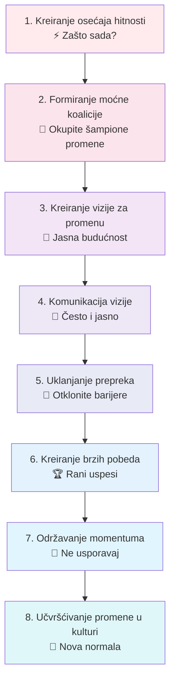
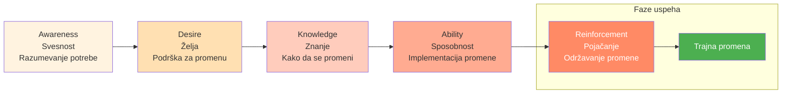
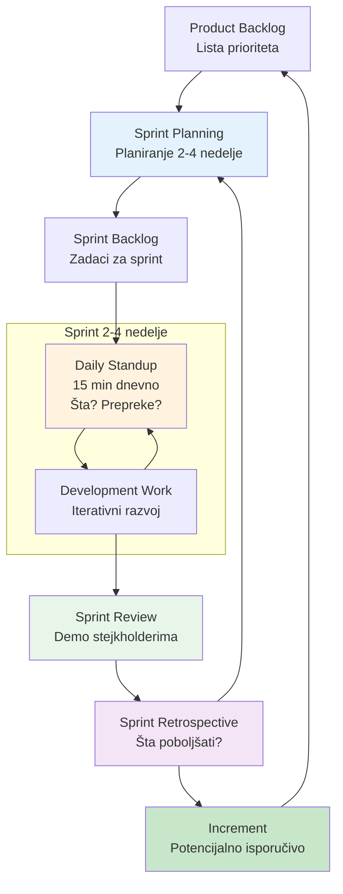
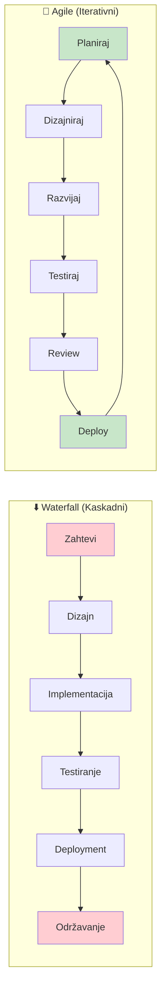

# 5. Promene i inovacije (Change and Innovation)

Promena je jedina konstanta u modernom bizn isu, a inovacija je motor dugoročnog uspeha. Ova oblast kompetencija pokriva upravljanje promenama, agilne metodologije, podsticanje inovativne kulture i kritičko razmišljanje. Lideri vešti u ovim veštinama mogu voditi svoje organizacije kroz tranzicije, podsticati kreativnost i kontinuirano prilagođavati se novim izazovima. U suštini, radi se ne samo o preživljavanju promene, već o njenoj iskorišćavanju za rast.

## Upravljanje promenama

**Upravljanje promenama** je disciplina vođenja pojedinaca, timova i organizacija kroz tranzicije – bilo da se radi o implementaciji nove strategije, usvajanju nove tehnologije ili reorganizaciji kompanije. Sumorjna činjenica je da mnoge inicijative za promene ne uspevaju da ispune svoje ciljeve. Zapravo, oko 70% inicijativa za promene propada, prema dugoročnom istraživanju.

### 📊 Vizualizacija: Kotter-ovih 8 koraka za upravljanje promenama

**ADKAR Model - Individualna perspektiva promene:**

One propadaju iz različitih razloga: nedostatak jasne vizije, loša komunikacija, neadresiranje "ljudske strane" promene, zamor od promena, itd. Kao lider, biti veš u upravljanju promenama znači da možete povećati šanse da vaše inicijative za promene uspeju umesto da se posrnu.

Dobar lider promene počinje jasnim artikulisanjem zašto je promena neophodna (adresiranje svrhe i hitnosti). John Kotter-ov model promene, na primer, navodi uspostavljanje osećaja hitnosti i jasne vizije kao prve korake. Zatim, treba angažovati stejkholdere na svim nivoima – promena je timski sport.

Komunicirajte, komunicirajte, komunicirajte: skoro je nemoguće previše komunicirati tokom promene. Jedna anketa je primetila da su glavni razlozi za otpor zaposlenih nedostatak poverenja u liderstvo (41%) i nedovoljna informacija (28%), tako da transparentna i česta komunikacija može prevenirati mnogo odbacivanja. Takođe, uključite ljude u proces ako možete (ono što Gartner naziva "open-source promena"): istraživanje sugeriše da angažovanje zaposlenih da ko-kreiraju promenu može podići stope uspeha značajno (neki podaci pokazuju povećanje verovatnoće uspeha sa 34% na 58% kroz takve inkluzivne pristupe).

Da razvijete veštine upravljanja promenama, proučavajte okvire kao što su Kotter-ovih 8 Koraka, Prosci-jev ADKAR model ili Bridges Transition model – oni pružaju korisne putokaze. Međutim, iskustvo je najbolji učitelj ovde. Volontirajte da vodite ili budete deo projekta promene. Moglo bi biti tako malo kao promena procesa izveštavanja tima ili tako veliko kao uvođenje nove linije proizvoda; ono što je važno je praksa principa: planiranje promene, upravljanje stejkholderima (ko je podržavajući, ko je skeptičan), postavljanje kanala povratnih informacija i pojačavanje promene jednom implementirane (tako da se drži).

Tražite mentore koji su vodili velike promene – možda lidera koji je nadgledao spajanje, ili rukovodioca koji je okrenuo borbu poslovne jedinice. Pitajte ih da podele ratne priče: šta je pošlo naopako, kako su rukovali otporom, šta bi učinili drugačije. Dobićete uvide koje nijedna knjiga ne može pružiti. Takođe, razmislite o obuci ili sertifikaciji u upravljanju promenama (Prosci nudi popularnu).

## Agilne metodologije

**Agilne metodologije** se odnose na skup principa i praksi izvorno rođenih u razvoju softvera (kroz Agile Manifesto) koje naglašavaju adaptabilnost, saradnju sa klijentima i iterativni napredak. Međutim, agilno razmišljanje sada je proželo mnoge oblasti biznisa zbog svoje efikasnosti u suočavanju sa neizvesnošću i brzim promenama.

### 📊 Vizualizacija: Agile Scrum Sprint ciklus

**Agile vs Waterfall - Poređenje:**

**Statistika uspešnosti:**
- Agile uspeh: 42% | Waterfall uspeh: 13%
- Agile neuspeh: 11% | Waterfall neuspeh: 59%

U suštini, biti agilan znači raditi u kratkim ciklusima, često preispitivati i prilagođavati planove, i uključivati stejkholdere tokom procesa. Kontrast je sa tradicionalnim "waterfall" pristupima koji planiraju velike projekte detaljno od početka i često se bore da se prilagode.

Savladavanje agilnih metodologija (kao što su Scrum, Kanban ili druge) može dramatično poboljšati stope uspeha projekata. Podaci su upečatljivi: Agilni projekti uspevaju daleko češće nego waterfall projekti – otprilike 42% uspeha naspram 13% uspeha u jednoj višegodišnjoj studiji. Slično tome, stopa neuspeha za agilne projekte bila je samo 11%, naspram 59% za waterfall u toj studiji. To je svedočanstvo sposobnosti agile-a da rukuje kompleksnošću i promenama bez da iskoči iz šina.

Kao lider, biti upućen u agilne metodologije znači da ih možete implementirati u svojim timovima ili bar podržati svoje timove u agilnom radu. Da razvijete ovu veštinu, počnite učenjem osnova Scrum-a (najpopularniji agilni okvir): koncepti kao što su sprintovi, dnevni stand-up sastanci, retrospektive, product backlog i uloge Scrum Master-a i Product Owner-a.

Postoje mnogi kursevi i sertifikacije (Certified Scrum Master, itd.) koji su korisni, ali takođe možete učiti čineći. Pokušajte voditi mali projekat na agilni način – razbijte ga u 1-2 nedeljne sprintove, imajte brze dnevne provere, demoisajte inkrement stejkholderima, i uključite povratne informacije kontinuirano. Moglo bi se osećati nezgodno ako ste navikli na teško unapredničko planiranje, ali verovatno ćete videti koristi u fleksibilnosti i timskom angažmanu.

Takođe, podržavajte agilni mentalitet: podsticajte eksperimentisanje i prihvatite da sve ne može biti predviđeno – ono što je važno je brzo reagovanje jednom kada se realnost odvije. Podsticajte vaš tim da rano iznosi probleme (agilni timovi cene transparentnost) i da redovno predlažu poboljšanja.

## Podsticanje inovativne kulture

**Kultura inovacije** znači kreiranje okruženja gde se nove ideje podstiču, testiraju i implementiraju da bi dodale vrednost. Nije samo o R&D laboratorijama – radi se o svakodnevnom kontinuiranom poboljšanju i povremenim prolomnim idejama u svim delovima biznisa.

Kao lider, podsticanje inovacije uključuje podsticanje kalkulisanog preuzimanja rizika, nagrađivanje kreativnosti i uklanjanje prepreka koje guše novo razmišljanje (kao što su strah od neuspeha ili previše rigidna birokratija). Kompanije poznate po inovaciji (Google, 3M, itd.) često dozvoljavaju zaposlenima vreme za istraživanje, one slave eksperimente (čak i one koji propadaju, kao prilike za učenje), i one osiguravaju da ljudi iz različitih pozadina sarađuju (pošto raznolikost pokreće kreativnost).

Da kultivišete ova ponašanja u vašem timu, počnite radom na psihološkoj sigurnosti – ljudi moraju osećati sigurno da dele "divlje" ideje ili priznaju kada nešto ne radi. Prema istraživanju o vodećim inovativnim radnim mestima, kreiranje psihološki bezbednog prostora gde su svi glasovi cenjeni je ključna karakteristika vodećih kompanija.

U takvom okruženju, neuspeh se ne susreće sa krivljom, već se vidi kao korak učenja. Na primer, neke kompanije imaju sesije gde lideri dele priče o svojim sopstvenim neuspesima i šta su naučili, što normalizuje to. Možete mimikirati ovo tako što ćete deliti lekcije iz projekta koji ste vodili a koji nije išao kako ste nadali.

Još jedna strategija je demokratizovati generisanje ideja: učiniti da bude lako za bilo koga da podnese ili predstavi ideje. Možete postaviti onlajn forum za ideje, ili mesečne sastanke za inovacije. Osigurajte da nije samo vrh menadžmenta čije ideje bivaju saslušane – često frontline zaposleni vide probleme i prilike koje drugi ne vide. Jedna firma je pronašla uspeh koristeći posvećeni alat gde "zaposleni mogu postavljati pitanja i predlagati rešenja dok ne dostignu uzajamno razumevanje" – ovaj egalitarni pristup doveo je do većeg angažmana i čak povećanja prihoda kroz implementirane ideje.

## Kritičko razmišljanje

**Kritičko razmišljanje** je sposobnost objektivne analize činjenica i donošenja obrazložene presude. To je osnova dobrog donošenja odluka i rešavanja problema. Za lidere, kritičko razmišljanje znači ne prihvatati informacije na njihovoj nominalnoj vrednosti, preispitivanje pretpostavki (vaših i drugih), i istraživanje više uglova problema pre zaključivanja.

U praksi, ovo bi moglo uključivati izvođenje analize osnovnog uzroka kada se problem dogodi umesto trenutnog krivljenja jednog faktora, ili bi moglo značiti sistematsko evaluiranje pro i kontra strateške odluke sa podacima i logikom. Veštine kritičkog razmišljanja pomažu u prosecanju pristrastva i slogana da bi se došlo do onoga što je realno.

Jačanje ove veštine zahteva naviku ispitivanja: uvek pitajte "Zašto?" i "Koji dokazi podržavaju ovo?" i "Da li smo sigurni u kauzalnost ovde?" Na primer, ako prodaja padne, nekritički pristup može biti "tržište je dole, ništa ne možemo." Kritički mislilac bi kopao dublje – da li je dole kroz sve proizvode ili samo jedan? Da li je konkurent nešto učinio? Da li se naša cena promenila? Slično, kada se suočavate sa predlogom, kritički razmišljajte o tome šta bi moglo poći naopako ili koje alternativne opcije postoje.

Neki načini za praksu uključuju čitanje studija slučaja poslovnih odluka i analiziranje šta biste učinili, igranje strategijskih igara ili puzla (koji mogu oštriti logiku) i angažovanje u debatama o različitim temama da vežbate formiranje argumenata i kontraargumenata. Takođe, budite svesni uobičajenih kognitivnih pristranosti (kao što su pristranost potvrđivanja, sidro, itd.) tako da možete uhvatiti ih u sebi i u timskim diskusijama.

Odličan savet od stručnjaka je postati svesniji vašeg procesa razmišljanja: na primer, pogledajte svoje prošle odluke – da li ste sakupili dovoljno dokaza? Da li ste razmatrali alternative ili samo otišli sa prvom idejom? Jedan od članaka o poslovnom razvoju naglasio je postati "svesniji i ispitivanje vaših pristranosti" da bi se poboljšalo strateško razmišljanje.

## Praktični saveti za razvoj

U sferi Promene i Inovacije, ime igre je fleksibilnost i otpornost. Podsticajte sebe i vaš tim da se udobno osetite sa idejom da promena nije privremena faza već nova normala. Možete praktično to činiti malim eksperimentima sa promenama redovno – npr. menjanje rutine u vašim timskim sastancima svakih par meseci (možda ko faciliira, ili kako postavljate agendu) samo tako da ljudi ne postanu previše ustaljeni u jedan način. Ovo gradi mišić za prihvatanje promene.

Slavite adaptabilnost kao snagu. Na primer, kada neko uspešno okrene projekat nakon što su nove informacije došle, priznajte to javno: "Želim da pohvalim X za brzo prilagođavanje naše strategije kada su zahtevi klijenta se promenili – ta agilnost spasla je projekat." Ovo pojačava adaptivno, agilno ponašanje kao deo kulture.

Za inovaciju, jedan savet je **koristiti metrike koje podstiču inovaciju** – ako su sve vaše KPI o kratkoročnoj proizvodnji ili efikasnosti, ljudi možda neće uzeti vreme da inoviraju. Razmislite o dodavanju metrike kao što je "% prihoda od novih proizvoda uvedenih u poslednje 2 godine" ili praćenje broja novih ideja testiranih svaki kvartal, da signalizirate da inovacija ima značaj.

Takođe, čuvajte se izgaranja u naporima promene i inovacije: zamor od promene je realan ako ljudi osećaju konstantnu nered. Balans je ključan – ne bi svaki aspekt trebao biti konstantno u promeni ili ćete iscrpiti sve. Izaberite svoje bitke (koje promene gurati i koje ostaviti da se stabilizuju) i jasno označite završnu liniju za velike promene tako da ljudi znaju kada da dišu.

Za inovaciju, slično, upravljajte pipeline tako da osnovne operacije ne trpe; integrirajte inovaciju u radni tok (kao inkrementalna poboljšanja procesa) umesto uvek odvojenih "velikih inovativnih projekata" koji mogu ometati. O kritičkom razmišljanju, jednostavna navika: kad god vi ili vaš tim donesete značajnu odluku, zapišite racionu osnovu i pretpostavke. Kasnije, ponovo posetite to i uporedite sa ishodima – ova refleksija će poboljšati buduću presudu. To je kao kalibracija vašeg kompasa za donošenje odluka tokom vremena.

Takođe **kreirajte okruženje gde je postavljanje pitanja "zašto" dobrodošlo**. Ako član tima pita vas "zašto radimo ovu inicijativu?", ne shvatajte to kao izazov vašem autoritetu već kao legitimno pitanje – odgovorite na njega ili priznajte ako ne znate i treba da saznate. Ovo će podstaći kulturu rasuđivanja umesto slepe egzekucije.

Jedna kompanija je otkrila da obuka menadžera da koriste coaching stil (postavljanje pitanja, vođenje otkrivanja) umesto comando-and-control stila značajno je povećala radoznalost i inovaciju u timovima. To je odličan uvid: vođenje sa pitanjima može biti moćnije od vođenja sa direktivama, posebno kada cilji sa inoviranjem i adaptiranjem.

Zaključno, da biste bili izvrsni u promeni i inovaciji, budite uzor adaptabilnosti i otvorenog uma. Pokažite da možete promeniti svoj um kada je predstavljen sa novim dokazima (to demonstrira stvarno kritičko razmišljanje i skromnost). Prihvatite male neuspehe kao učenje (možda uradite što neki startapi rade i imajte "neuspeh meseca" diskusiju, izvlačeći lekcije iz toga). Podsticajte brainstorming i onda pomozite da kanalizujete te brainstormove u akciju sa agilnom egzekucijom.

Kontinuiranim skaniranjem horizonta (tržišni trendovi, nove tehnologije) i pozivom vašeg tima da čini isto, osiguravate da nećete biti uhvaćeni na manju. Kao što poznata izreka kaže, "promena je jedina konstanta", tako da napravite liderstvo promene i inovacije osnovnim delovima vašeg identiteta kao lidera. Učinite to, i vaš tim neće samo preživeti promenu – oni će napredovati u njoj, nalazeći nove i bolje načine za uspeh.
