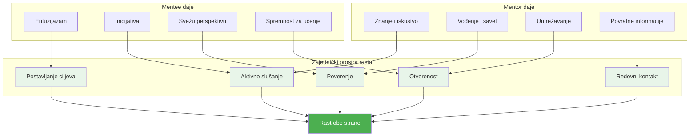
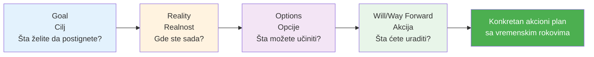
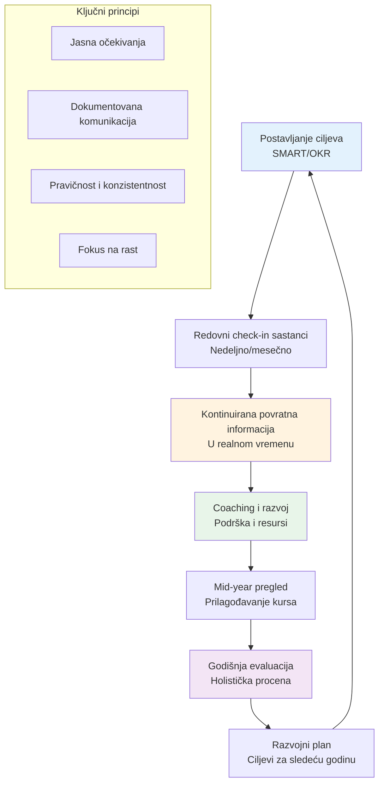
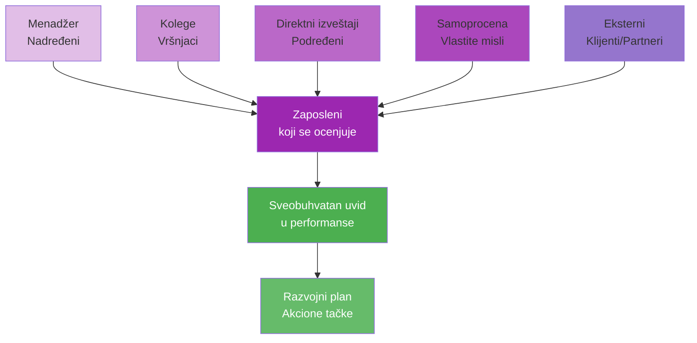

# 6. Mentorstvo i podrška (Mentorship and Support)

Poslednja oblast kompetencija centrira se oko toga kako lideri razvijaju druge i kreiraju podržavajuće zajednice. Ona uključuje mentorstvo i koučing, razvoj liderstva, izgradnju zajednice i upravljanje performansama. Ove veštine osiguravaju da ne samo možete poboljšati sopstvene performanse, već takođe podići druge i izgraditi uspešan tim ili organizacionu kulturu. Na mnoge načine, ova oblast povezuje sve prethodne – jer nasleđe lidera često su ljudi koje su mentorišli i kultura koju su oblikovali.

## Mentorstvo i koučing

**Mentorstvo i koučing** se odnose na to da jedna osoba (obično iskusnija) vodi drugu da raste i uspe. Kao lider, možete igrati ulogu mentora/kouča za članove vašeg tima ili druge u organizaciji. Takođe, traženje mentora za sebe je ključno za vaš kontinuirani rast (bez obzira koliko ste viši, uvek postoji nešto da naučite iz iskustava drugih).

### 📊 Vizualizacija: Odnos mentorstva

**GROW Model za koučing razgovore:**

Hajde da razbijemo ovo na dve perspektive: biti mentor i biti mentorisan. Kada delujete kao mentor ili kouč, vaš posao je da slušate, postavljate produbljena pitanja, delite znanje i pružate podsticaj i povratne informacije. Dobri mentori ne samo da daju odgovore – često vode mentee da sami pronađu odgovore, što je osnažujuće.

Uticaj mentorstva je dobro dokumentovan: Programi mentorstva daju liderima u nastajanju personalizovano vođenje, prenos znanja i prilike za umrežavanje, značajno povećavajući njihov razvoj veština. Mentori takođe često služe kao uzori za liderske vrednosti i ponašanja. Da postanete bolji mentor, praktikujte aktivno slušanje (kao što je diskutovano u odeljku 3) i naučite neke koučing tehnike (na primer, GROW model – Goal, Reality, Options, Will – za strukturisanje razvojnih razgovora).

Budite pristupačni i poverljivi, tako da se mentee osećaju sigurno diskutujući izazove. Takođe, investirajte vreme – mentorstvo je odnos, i redovne provere (čak i kratke) grade momentum više nego jednokratni razgovori. Ako niste mentorišli ranije, razmislite o početku putem formalnog programa ako vaša kompanija ili zajednica ima jedan; oni često pružaju obuku o procesu mentorstva.

Sa druge strane, kao mentee, preduzimajte inicijativu da tražite mentore koji se usklađuju sa vašim razvojnim potrebama. Razmislite o veštinama ili karijernim potezima koje težite – ima li neko ko je prošao tim putem? Obratite se poštovano, i budite jasni o tome šta tražite (moglo bi biti jednokratni sastanak ili dugoročnije mentorstvo). Mnogi ljudi su iznenađujuće voljni da pomognu ako pokažete entuzijazam i poštovanje za njihovo vreme.

Jedna izuzetno korisna praksa je da imate **više mentora za različite oblasti**. Na primer, možete imati jednog mentora unutar vaše kompanije za navigaciju internom politikom, drugog u vašoj industriji za tehničko vođenje i možda bivšeg profesora ili eksternog kouča za savet o liderstvu. Mentori vam mogu pomoći da "izbegnete uobičajene greške, proširite vašu mrežu i razvijete strategičniju viziju" vaše uloge – u suštini ubrzavajući vašu krivu učenja sa njihovim teško stečenim lekcijama.

Podaci podržavaju vrednost mentorstva: organizacije sa programima mentorstva izveštavaju o većem angažmanu zaposlenih i stopama promocije, a za pojedince mentorstvo često korelira sa većim performansama i zadovoljstvom u karijeri. Kako napredujete, takođe razmislite o prilikama za obrnuto mentorstvo – možete učiti od mlađih kolega (o novoj tehnologiji, kulturnim trendovima, itd.) dok oni uče od vas, kreirajući uzajamni win-win.

Bilo da ste mentor ili mentee, pristupite odnosu sa skromnošću i otvorenošću. Mentorstvo nije jednosmerna ulica – oba učesnika često uče jedno od drugog i nalaze iskustvo nagrađujućim.

## Razvoj liderstva

Ovo se preklapa sa mentorstvom ali na široj, programskoj skali. **Razvoj liderstva** se odnosi na pripremu sledeće generacije lidera i kontinuirano poboljšanje sposobnosti sadašnjih lidera. Iz organizacijske perspektive, uključuje planiranje sukcesije, programe obuke, stretch zadatke i druge strategije za izgradnju liderske snage na klupi. Za pojedinačnog lidera, znači aktivno rad na razvoju liderskih kvaliteta kod članova vašeg tima – u suštini, "čineći sebe zamenljivim" tako što osnažujete druge (karakteristika velikih lidera).

Kompanije koje se ističu u razvoju liderstva ostvaruju mnoge koristi: vide poboljšano donošenje odluka, višu motivaciju i zadržavanje zaposlenih, kulturu inovacije i veću otpornost prema promenama. Kao primer, famozni GE-ov programi liderstva ili Deloitte-ova raznolikost liderskih inicijativa (za žene, za manjine, za veterane, itd.) citirani su kao ključni za njihov dugoročni uspeh.

Da ojačate svoje veštine u razvoju liderstva, počnite identifikovanjem pojedinaca sa visokim potencijalom u vašem timu i dajte im prilike da vode u nekoj kapaciteti. Moglo bi biti vođenje malog projektnog tima, predstavljanje odeljenja na sastanku ili mentorišu novog zaposlenika. Vodite ih, a zatim se povucite i dopustite im da uče kroz rad (i budite tu da podržite ako posustanu).

Zalaže se za razvojne potrebe članova vašeg tima – ako bi neko imao koristi od određenog kursa ili konferencije, pomozite im da ga dobiju. Takođe, svesno delite lidersko znanje: ako ste prisustvovali sjajnom seminaru ili naučili nešto iz ovog veoma dubokog istraživačkog zadatka, proširite to vašem timu.

Još jedan aspekt je **liderstvo primerom**: demonstrirajte liderske kvalitete koje želite usaditi – integritet, viziju, empatiju, odlučnost, itd. Ljudi često uče ponašanja posmatranjem, tako da budite svesni primera koji postavljate.

## Izgradnja zajednice

U kontekstu radnog mesta, **izgradnja zajednice** znači kreiranje osećaja pripadnosti i uzajamne podrške među zaposlenima – pretvaranje grupe kolega u tesno povezanu zajednicu. Ovo je donekle opipljivo, ali njegovi efekti su veoma realni: veće zadovoljstvo poslom, bolja saradnja i niža fluktuacija. Snažan osećaj zajednice zadovoljava osnovne ljudske društvene potrebe čak i na poslu.

Kada se ljudi osećaju "cenjeno, povezano i ispunjeno" kao deo zajednice na poslu, dobijate "srećniju, zdraviju, angažovaniju radnu snagu – i bolju donju liniju." Kao lider, imate veliki uticaj na zajednicu. Da bi je podstakli, fokusirajte se na inkluziju i izgradnju odnosa. Podsticajte timske rituale i tradicije – možda je to nedeljni neformaln coffee chat, slavlje rođendana ili prelomnih trenutaka, volontiranje zajedno ili team-building izlete. Ovo kreira deljene doživljaje izvan samih poslova.

Takođe, budite namerni u pomaganju ljudima da upoznaju jedni druge kao pojedinci. U udaljenim ili hibridnim okruženjima, ovo je teže ali još moguće (virtuelne timske igre, ili imati Slack kanal za ne-poslo banter). Promovisajte kulturu dobrote i podrške – npr., ako se neko bori sa zadatkom, podsticajte druge da pomognu (dok osiguravate da niko uvek nije davač bez priznanja).

Suprotstavite se ponašanjima koja ugrožavaju zajednicu (npr. formiranje klika, isključenje ili bilo koja vrsta diskriminacije). Jedan efikasan pristup je uspostavljanje peer support sistema ili "buddy" sistema, tako da svako ima nekoga na koga se mogu osloniti. Drugo je podržavanje Employee Resource Groups (ERG) ako ih vaša kompanija ima – grupe koje okupljaju ljude sa zajedničkim interesima ili pozadinama mogu ojačati širu zajednicu osiguravajući da se ti glasovi čuju i slave.

Na primer, grupa Women in Tech ili Young Professionals može pružiti dodatnu kamaraderiju i razvoj, što se preliva u inkluzivnije okruženje širom kompanije.

## Upravljanje učinkom

**Upravljanje učinkom** je proces postavljanja ciljeva, praćenja napretka, pružanja povratnih informacija i evaluiranja ishoda za zaposlene (i timove). Dobro urađeno, usklađuje sve sa organizacionim ciljevima, motiviše ljude kroz jasna očekivanja i prilike za rast, i rešava probleme pre nego što se ugnezde.

### 📊 Vizualizacija: Kontinuirani ciklus upravljanja performansama

**360-Stepena povratna informacija:**

Loše urađeno, može demoralizovati ili kreirati konfuziju. Moderno upravljanje učinkom se pomera od teških godišnjih pregleda ka kontinuiranijoj povratnoj informaciji i koučingu, što se lepo vezuje sa mentorstvom i podrškom.

Da biste izvrsnosti u upravljanju učinkom, počnite sa jasnim postavljanjem ciljeva. Koristite okvire kao što su SMART ciljevi ili OKR (Objectives and Key Results) tako da zaposleni znaju tačno šta se očekuje i kako će se uspeh meriti. Kada ljudi imaju nejasne ili sukobljene ciljeve, frustracija i loše performanse slede – podsetite se da je nejasnoća u ulogama ili ciljevima glavna prepreka uspehu (38% organizacija to navodi kao veliki problem). Dakle, razjasnite uloge i ciljeve.

Zatim, redovna povratna informacija je ključna. Ne čekajte godišnju evaluaciju da kažete nekome kako rade. Brza, specifična povratna informacija (i pohvala i konstruktivne sugestije) odmah nakon događaja je najefikasnija. Na primer, ako je zaposlenik vodio sastanak naročito dobro, recite im tog dana. Ako su pogrešno rukovali klijentskim pozivom, diskutujte to dok je sveže i vodite ih o tome šta učiniti drugačije.

Kultura kontinuirane povratne informacije pomaže ljudima da brzo prilagode kurs i ne plaše se "pregleda" jer ništa nije iznenađenje. Ugradite multi-izvornu povratnu informaciju gde je moguće – ponekad nazvan 360-stepena povratna informacija – gde vršnjaci, podređeni i drugi mogu pružiti input. Ovo daje potpuniju sliku i često iznosi na površinu snage ili probleme koje pojedinačni menadžer možda ne vidi. Takođe pomaže osećaj pravednosti i otvorenosti.

## Praktični saveti za razvoj

U domenu Mentorstva i Podrške, jedan sveobuhvatni princip je **sluga liderstvo**. Skovano od strane Roberta Greenleaf-a, sluga liderstvo se odnosi na vođenje služenjem drugima – fokusiranje primarno na rast i dobrobit ljudi i zajednica oko vas. Usvajanje ovog mentaliteta će prirodno voditi vas ka mentorstvu, podržavanju, razvoju drugih i izgradnji pozitivne zajednice.

Konkretno, možete praktikovati sluga liderstvo tako što ćete redovno pitati vaš tim "Kako vam mogu pomoći da radite svoj najbolji posao?" ili "Šta vam je potrebno od mene da postignete svoje ciljeve?" – a zatim činiti sve da to obezbedite. Napravite to delom vaše rutine da proverite lični razvoj pojedinaca: možda u jedan-na-jedan sastancima, pored ažuriranja statusa, namerno diskutujte njihove karijerske aspiracije ili da li osećaju da uče.

Održavajte "talent board" za vaš tim – jednostavna tabela ili dokument gde beležite ključne snage svake osobe, oblasti za poboljšanje, interese i razvojne akcije (kursevi, projektne prilike, itd.). Pregledajte ga kvartalno da osigurate da svi napreduju. Ovo drži ljude da se ne "izgube u gužvi", posebno u većim timovima ili užurbanim periodima.

Još jedan savet je da **podsticajte mentorstvo izvan sebe**: olakšajte peer mentorstvo ili postavite timski "buddy sistem" gde noviji ljudi sparujete sa veteranima. Ne samo da ovo množi deljenje znanja, već takođe olakšava vaš sopstveni teret kao jedino mesto mentorstva. Za izgradnju zajednice, pronađite načine da utkate zabavu i ljudsku povezanost u posao.

Čak i mali napori – kao što je kudos tabla gde članovi tima mogu zahvaliti jedan drugom, ili brzo "pitanje za zagrevanje nedelje" u timskim sastancima – mogu polako izgraditi kamaraderiju. Praćenje zdravlja zajednice vašeg tima sa pulse anketama ili jednostavno posmatranjem interakcija (da li ljudi šale i pričaju slobodno ili striktno poslovno? Da li izgleda da imaju jedan drugima leđa?).

Ako osetite distancu, iniciirajte iskreni razgovor o timskoj dinamici i šta bi moglo da se poboljša. Ponekad priznanje da "hej, bili smo tako zaposleni da se nismo povezali kao tim u poslednje vreme" i onda organizovanje neformalnog druženja ili timskog lunch-a može resetovati ton.

U upravljanju performansama, praktični hack: **zakažite kratke kvartalne razgovore o napretku** (odvojeno od velikog godišnjeg pregleda) da osigurate da niko ne skreće sa puta predugo i da pojačate taj mentalitet kontinuiranog poboljšanja. Takođe, dokumentujte pohvalu i probleme tokom godine – možda vodite privatni dnevnik za svakog člana tima. Na ovaj način, kada dođe vreme pregleda, imate konkretne primere i niste pod uticajem samo nedavnih događaja (recency bias).

Iznad svega, **pitajte svoje ljude za povratnu informaciju o vašoj podršci kao lider**: Da li se osećaju podržano? Da li dobijaju dovoljno povratnih informacija? Da li osećaju da mi je stalo do njih i njihovog razvoja? Budite otvoreni prema onome što čujete i delujem na osnovu toga. Na primer, ako neko kaže, "Ne dobijam mnogo povratnih informacija osim ako nešto nije u redu," to je signal da povećate pozitivno pojačavanje i koučing.

Zaključno, budući da ste lider koji mentoriše, razvija, podržava i iskreno brine, kreirate leverage – mnogostrukte svoj uticaj kroz druge. Često citirana liderska misao je da istinska mera lidera nije ono što oni lično postižu, već ono što njihovi ljudi postižu. Vaše nasleđe su lideri koje kreirate. Kako mentorisate i osnažujete druge, verovatno ćete naći da je to duboko nagrađujuće takođe – videti nekoga koga ste koučovali da dobije unapređenje ili prevazi izazov može se osećati još bolje nego činiti to sami.

Kreira vrli krug: podržavajuća kultura vodi uspehu, što vodi većoj spremnosti da se podržavaju drugi. Održavajte taj krug u pokretu, i vaš tim ili organizacija će napredovati ne samo u metrikama, već kao mesto koje ljudi vole da rade.
